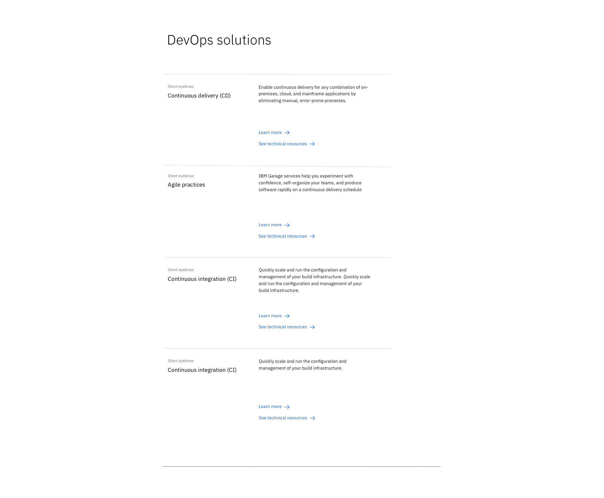

<PageDescription>

The content group — horizontal pattern can be used to present important areas of interest relating to your topic, such as products or solutions. 

</PageDescription>

<AnchorLinks>

<AnchorLink>Default</AnchorLink>
<AnchorLink>Development documentation</AnchorLink>
<AnchorLink>Specification documentation</AnchorLink>
<AnchorLink>Feedback</AnchorLink>

</AnchorLinks>

## Default
The content group — horizontal consists of a heading followed by a series of content pieces each with their own eyebrow, heading, paragraph and CTA's. Horizontal rules are used to divide each content piece.

## Development documentation

| Language      | Status        | Sandbox                                                                              |
| ------------- | -----------   | ------------------------------------------------------------------------             |
| React         | 
<pre>Stable</pre>
        | [View storybook](https://ibmdotcom-react.mybluemix.net/?path=/story/patterns-blocks-contentgrouphorizontal--default)     |
| Vanilla       | 
<pre>Under construction</pre>
  |

## Specification documentation

Structure and spacing measurements for the "Content group  &mdash; horizontal" pattern can be viewed [here](https://ibm.box.com/s/rv5kmm0a4d9ded74v6yfk8ad5id5ghmx).

## Feedback

Help us improve this component by providing feedback, asking questions, and leaving any other comments on [GitHub](https://github.com/carbon-design-system/ibm-dotcom-library).
