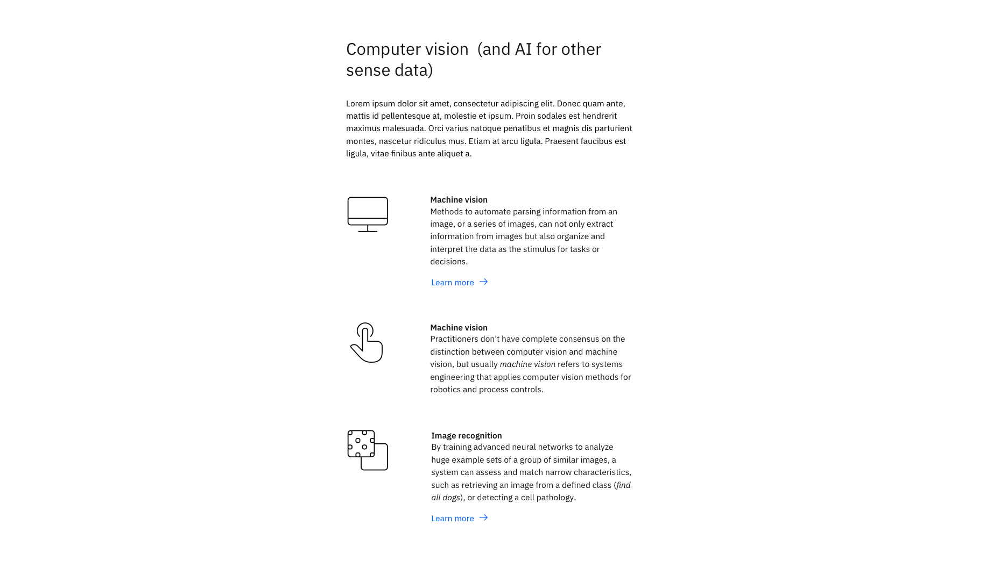

<PageDescription>

The content group  &mdash; with pictograms pattern is to present a group of information, each with a supporting pictogram.

</PageDescription>

<AnchorLinks>

<AnchorLink>Default</AnchorLink>
<AnchorLink>Development documentation</AnchorLink>
<AnchorLink>Specification documentation</AnchorLink>
<AnchorLink>Feedback</AnchorLink>

</AnchorLinks>

## Default
The content group  &mdash; with pictograms pattern consists of a heading, introduction, and a series of concise content each with their own pictogram. The pictograms are useful for visually engaging users and conveying important information through illustration. The pictogram can be viewed and download the IBM Design Language pictogram library.

## Development documentation

| Language      | Status        | Sandbox                                                                              |
| ------------- | -----------   | ------------------------------------------------------------------------             |
| React         | 
<pre>Stable</pre>
        | [View storybook](https://ibmdotcom-react.mybluemix.net/?path=/story/patterns-blocks-contentgrouppictograms--default)     |
| Vanilla       | 
<pre>Under construction</pre>
  |

## Specification documentation

Structure and spacing measurements for the "Content group  &mdash; with pictograms" pattern can be viewed [here](https://ibm.box.com/s/af11r4k5fv1wclv1yrl9aic5c68x29ra).

## Feedback

Help us improve this component by providing feedback, asking questions, and leaving any other comments on [GitHub](https://github.com/carbon-design-system/ibm-dotcom-library).
