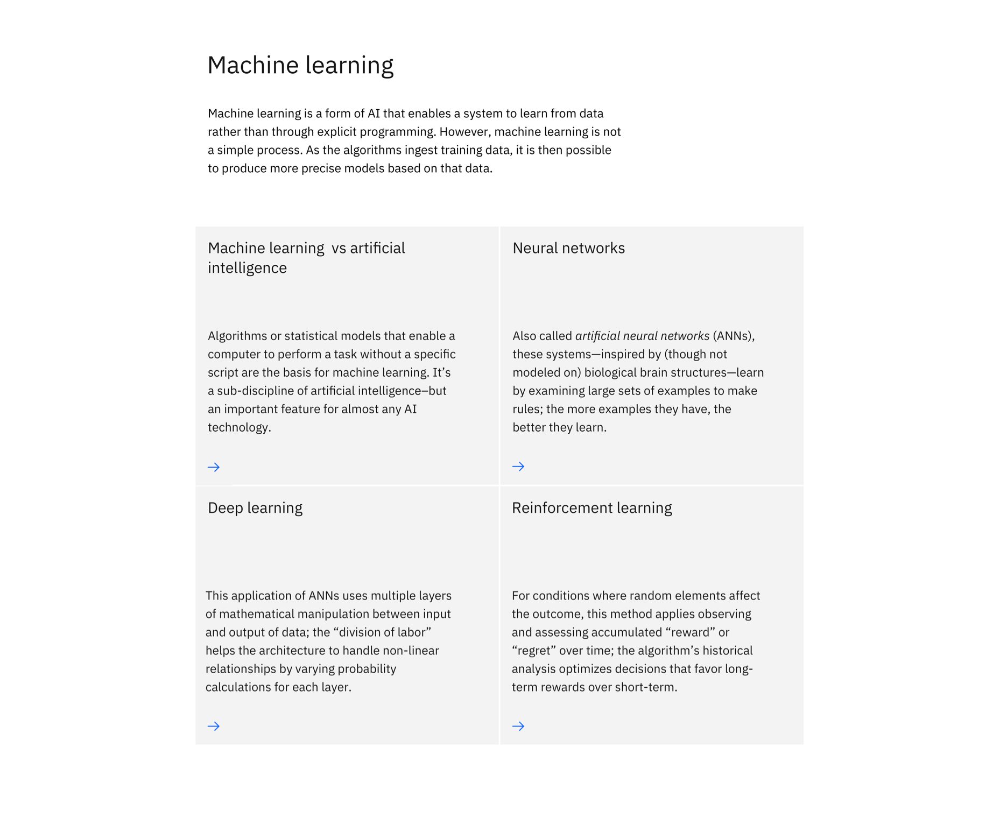

<PageDescription>

Content group &mdash; with cards is used to present information through a group of cards with each acting as a call to action that drives to additional or supporting destinations.

It is suitable for adding concise buckets of content and links to a long-form reading experience.

</PageDescription>

<AnchorLinks>

<AnchorLink>Default</AnchorLink>
<AnchorLink>Design and functional specifications</AnchorLink>
<AnchorLink>Development documentation</AnchorLink>
<AnchorLink>Feedback</AnchorLink>

</AnchorLinks>

## Default
Content group &mdash; with cards includes a section heading, body copy, and any number of card components listed below. This pattern can be used multiple times within a content block.

## Design and functional specifications

The design specs and functional specs for Content group &mdash; with card can be viewed <a href="https://ibm.box.com/s/5sfef66ow9ruw47qye5snhnxey0ioi6t" target="_blank">here</a>.

## Development documentation

| Language      | Status        | Sandbox                                                                              |
| ------------- | -----------   | ------------------------------------------------------------------------             |
| React         | 
<pre>Stable</pre>
        | <a href="https://ibmdotcom-react.mybluemix.net/?path=/story/components-contentgroupcards--default" target="_blank">View storybook</a>    |
| Web Components       | 
<pre>Under construction</pre>
  | Coming soon |

## Feedback

Help us improve this component by providing feedback, asking questions, and leaving any other comments on <a href="https://github.com/carbon-design-system/ibm-dotcom-library" target="_blank">GitHub</a>.
