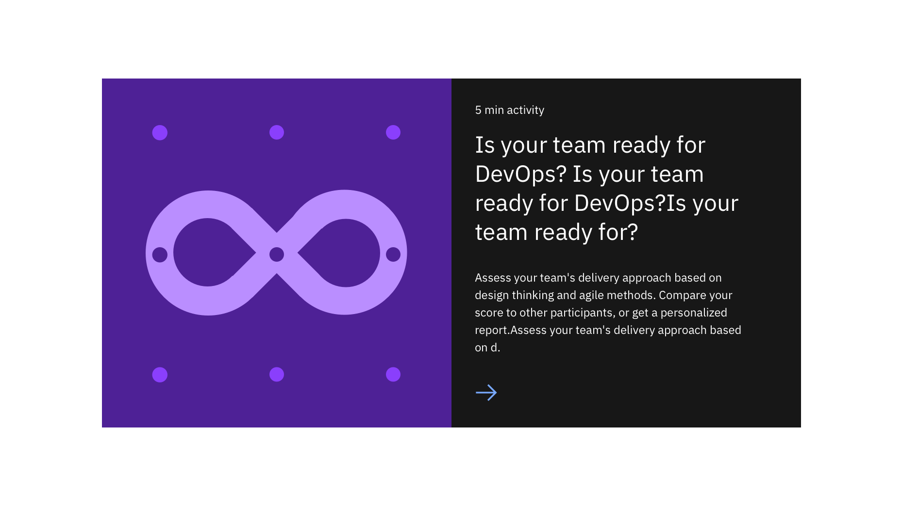

<PageDescription>

The feature card block pattern is used to present information with a group of cards.

</PageDescription>

<AnchorLinks>

<AnchorLink>Feature card block medium</AnchorLink>
<AnchorLink>Feature card block large</AnchorLink>
<AnchorLink>Development documentation</AnchorLink>
<AnchorLink>Specification documentation</AnchorLink>
<AnchorLink>Feedback</AnchorLink>

</AnchorLinks>

## Feature card block medium
The feature card blocks medium pattern is used to present a group of information with a medium size card with an image.

## Feature card block large
The feature card blocks large pattern is used to present main piece of content as a main feature.

## Development documentation

| Language      | Status        | Sandbox                                                                              |
| ------------- | -----------   | ------------------------------------------------------------------------             |
| React         | 
<pre>Stable</pre>
        | [View storybook](https://ibmdotcom-react.mybluemix.net/?path=/story/patterns-blocks-featurecardblockmedium--default)     |
| Vanilla       | 
<pre>Under construction</pre>
  |

## Specification documentation

Structure and spacing measurements for the Feature card block medium pattern can be viewed [here](https://ibm.box.com/s/pasipprq3njaholcg9bgtnv7khzq4kkq) and the Feature card block large pattern can be viewed [here](https://ibm.box.com/s/fort8v1pj93z0ax6zgipcu0mbxsuwry1).

## Feedback

Help us improve this component by providing feedback, asking questions, and leaving any other comments on [GitHub](https://github.com/carbon-design-system/ibm-dotcom-library).
