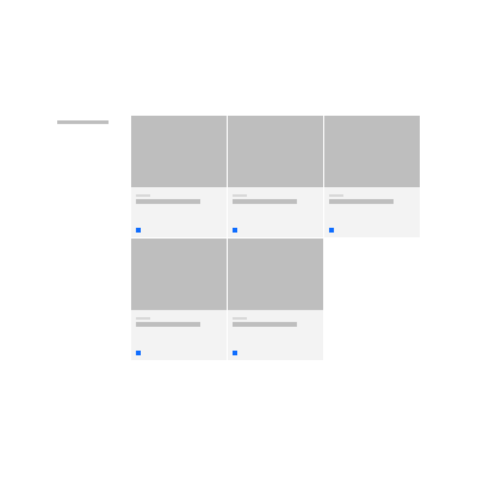
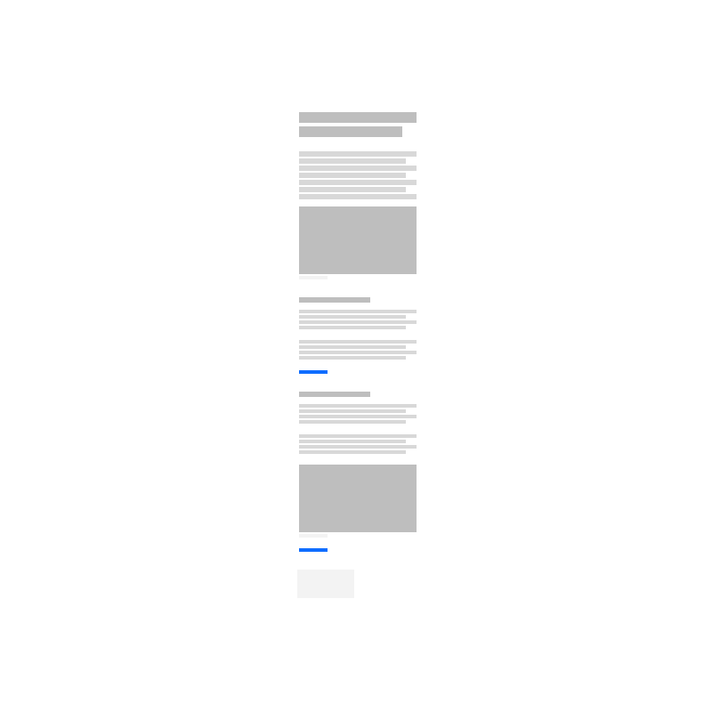

## Layout patterns

<Row className="image-card-group">
   <Column colMd={3} colLg={3} noGutterSm>
 <ImageCard
   title="Callout – quote"
   titleColor="dark"
   href="/components/footer"
   aspectRatio="1:1"
   hoverColor="dark"
 >

 

 </ImageCard>
 </Column>
 <Column colMd={3} colLg={3} noGutterSm>
 <ImageCard
   title="Callout – with media"
   titleColor="dark"
   href="/components/masthead"
   aspectRatio="1:1"
   hoverColor="dark"
 >

 

 </ImageCard>
   </Column>
   <Column colMd={3} colLg={3} noGutterSm>
 <ImageCard
   title="Card section – with image"
   titleColor="dark"
   href="/components/footer"
   aspectRatio="1:1"
   hoverColor="dark"
 >

 

 </ImageCard>
 </Column>
 <Column colMd={3} colLg={3} noGutterSm>
 <ImageCard
   title="Card section – simple"
   titleColor="dark"
   href="/components/masthead"
   aspectRatio="1:1"
   hoverColor="dark"
 >

 

 </ImageCard>
   </Column>
   <Column colMd={3} colLg={3} noGutterSm>
 <ImageCard
   title="Content block – with cards"
   titleColor="dark"
   href="/components/footer"
   aspectRatio="1:1"
   hoverColor="dark"
 >

 

 </ImageCard>
 </Column>
 <Column colMd={3} colLg={3} noGutterSm>
 <ImageCard
   title="Content block – with cards"
   titleColor="dark"
   href="/components/masthead"
   aspectRatio="1:1"
   hoverColor="dark"
 >

 

 </ImageCard>
   </Column>
   <Column colMd={3} colLg={3} noGutterSm>
 <ImageCard
   title="Content block – with media"
   titleColor="dark"
   href="/components/footer"
   aspectRatio="1:2"
   hoverColor="dark"
 >

 

 </ImageCard>
 </Column>
 <Column colMd={3} colLg={3} noGutterSm>
 <ImageCard
   title="Content block – mix groups"
   titleColor="dark"
   href="/components/masthead"
   aspectRatio="1:2"
   hoverColor="dark"
 >

 

 </ImageCard>
   </Column>
      <Column colMd={3} colLg={3} noGutterSm>
 <ImageCard
   title="Content block – segmented"
   titleColor="dark"
   href="/components/footer"
   aspectRatio="1:2"
   hoverColor="dark"
 >

 

 </ImageCard>
 </Column>
   <Column colMd={3} colLg={3} noGutterSm>
 <ImageCard
   title="Content group – horizontal"
   titleColor="dark"
   href="/components/footer"
   aspectRatio="1:1"
   hoverColor="dark"
 >

 

 </ImageCard>
 </Column>
 <Column colMd={3} colLg={3} noGutterSm>
 <ImageCard
   title="Content group – pictogram"
   titleColor="dark"
   href="/components/masthead"
   aspectRatio="1:1"
   hoverColor="dark"
 >

 

 </ImageCard>
   </Column>
   <Column colMd={3} colLg={3} noGutterSm>
 <ImageCard
   title="Content group – simple"
   titleColor="dark"
   href="/components/footer"
   aspectRatio="1:1"
   hoverColor="dark"
 >

 

 </ImageCard>
 </Column>
 <Column colMd={3} colLg={3} noGutterSm>
 <ImageCard
   title="CTA section"
   titleColor="dark"
   href="/components/masthead"
   aspectRatio="1:1"
   hoverColor="dark"
 >

 

 </ImageCard>
   </Column>
   <Column colMd={3} colLg={3} noGutterSm>
 <ImageCard
   title="Feature card – block large"
   titleColor="dark"
   href="/components/footer"
   aspectRatio="1:2"
   hoverColor="dark"
 >

 

 </ImageCard>
 </Column>
 <Column colMd={3} colLg={3} noGutterSm>
 <ImageCard
   title="Feature card – block medium"
   titleColor="dark"
   href="/components/masthead"
   aspectRatio="1:1"
   hoverColor="dark"
 >

 

 </ImageCard>
   </Column>
    <Column colMd={3} colLg={3} noGutterSm>
 <ImageCard
   title="Lead space – block"
   titleColor="dark"
   href="/components/masthead"
   aspectRatio="1:1"
   hoverColor="dark"
 >

 

 </ImageCard>
   </Column>
    <Column colMd={3} colLg={3} noGutterSm>
 <ImageCard
   title="Lead space"
   titleColor="dark"
   href="/components/masthead"
   aspectRatio="1:1"
   hoverColor="dark"
 >

 

 </ImageCard>
   </Column>
    <Column colMd={3} colLg={3} noGutterSm>
 <ImageCard
   title="Logo grid – rich"
   titleColor="dark"
   href="/components/masthead"
   aspectRatio="1:1"
   hoverColor="dark"
 >

 

 </ImageCard>
   </Column>
   
 </Row>

