<PageDescription>

In Carbon for IBM.com, layout patterns comprise common user flows and scenarios which are too complex or too universal to be encapsulated in a single component. Individual layout patterns often include two or more components from the system or apply to multiple components independently. 
 
The layout patterns library is constantly growing, and the Carbon for IBM.com core team encourages contributions of UX layout patterns which can apply to a broad set of Carbon for IBM.com adopters. 

</PageDescription>

 

## Resources

<Row className="resource-card-group">
<Column colMd={4} colLg={4} noGutterSm>
    <ResourceCard
      subTitle="IBM.com Pattern React Storybook (experimental)"
      aspectRatio="2:1"
      actionIcon="arrowRight"
      href="https://ibmdotcom-patterns-react-experimental.netlify.com/?path=/story/*"
      >

 
</ResourceCard>
</Column>
</Row>

 

## Layout patterns

| Name              | Status                                                                                                             |
 | ---------------------------------------------- | ------------------------------------------------------------------------------------------------------------ |
| Array with cards     | Coming soon |
| Array with pictograms | Coming soon |
| [Lead space – left-aligned](/patterns/leadspace) | Available |
| [Lead space – centered](/patterns/leadspace) | Coming soon |
| Logo grid | Coming soon |
| Rich overview | In progress |
| Simple array | Coming soon |
| Simple benefits | Coming soon |
| Simple long-form | Coming soon |
| Simple overview | Coming soon |
| Testimonials | In progress |
| Use cases | Coming soon |

## Applying layout principles

By leading with [IBM Design Language layout principles](https://www.ibm.com/design/language/layout/overview/) when designing patterns, we move closer to achieving a consistent tone of voice and brand expression across all of IBM's platforms. The examples below serve as inspiration for designers and makers, and illustrate how content can be arranged to achieve a layout that reflects IBM's distinct point-of-view.

### Essential
* Form follows function. Nothing is gratuitous or there for decoration.
* Ample negative space opens up the design.
* The message or goal of the design is clear.
* Structure is as simple as possible until additional complexity is needed.

#### Simple centered
The surrounding white space allows the user to focus  on the centered content. A good choice for long-form  reading, lead space content, and rich media.

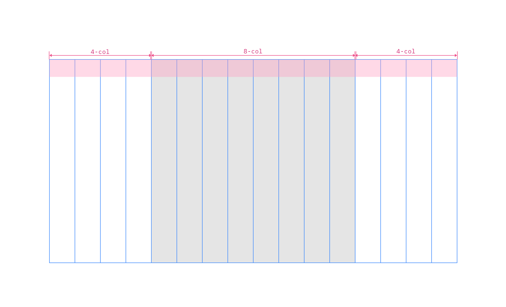

 

#### Simple centered with heading or table of contents
For dense or complex pages and patterns, a supporting heading or table of contents component provides additional content to the user.

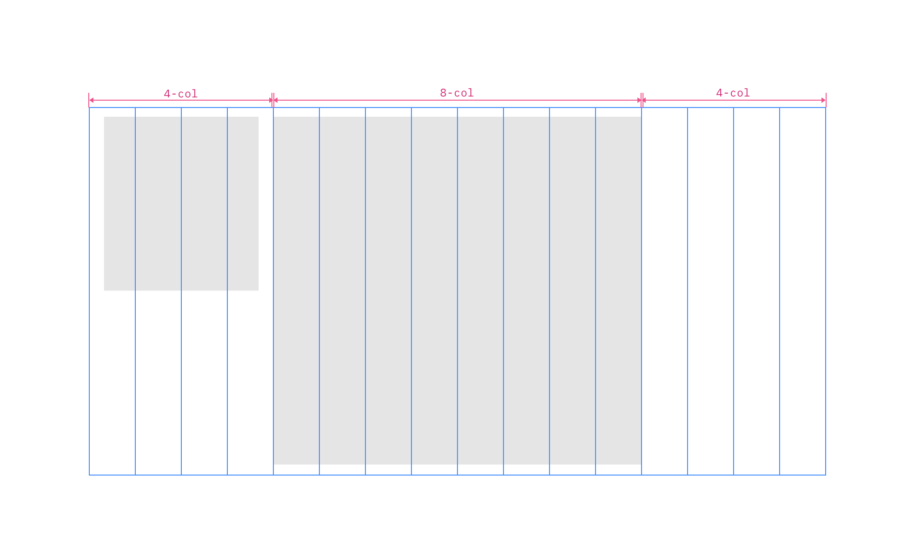

 

#### Half and half with background image
This layout maximizes the 2x grid. All columns are given a function – to display information and rich media. An effective option for lead space left-aligned, testimonials and product features.

 

#### Half and half with centered image
Here, the first half of the layout has greater hierarchy and prominence.

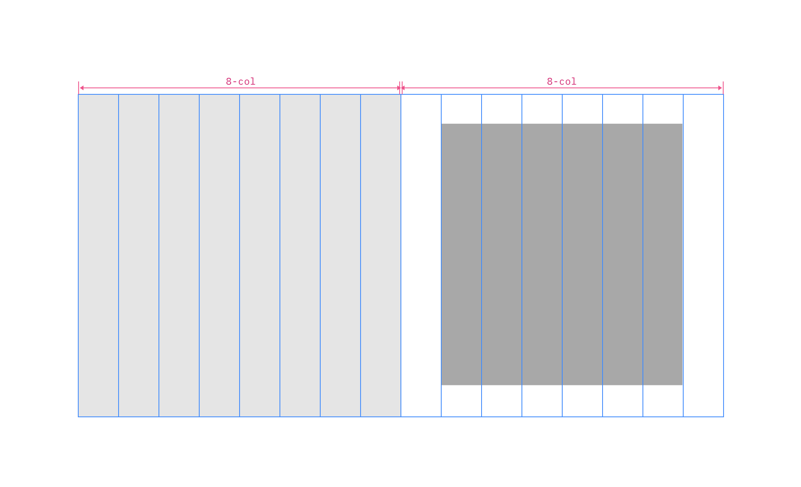

 

### Dynamic
* Positive and negative space work together in asymmetric balance.
* Asymmetric layouts help create qualities of space and depth.
* Compositions elicit a sense of movement and vitality.
* Expectations are broken with surprise and delight.
* Experimentation and playfulness are apparent.

#### Staggered and stacked
This playful composition brings a sense of movement to the content display.

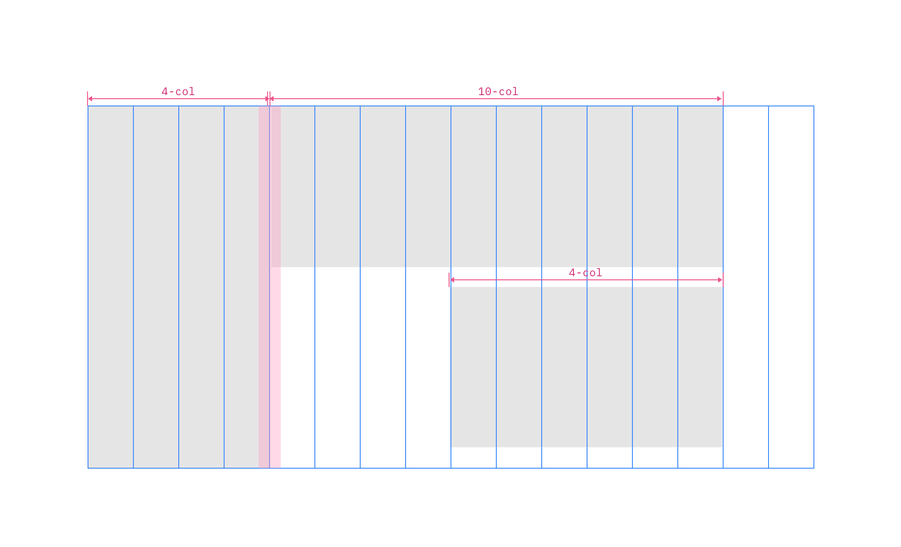

 

#### Left heading with large content area
This asymmetrical layout is ideal for drawing the viewer into a main body of content. The balance of negative to positive space and low to high contrast zones elicits a sense of scale and dynamism. 

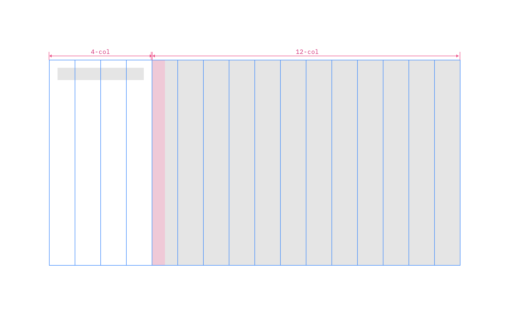

 

**Lead in from the left**

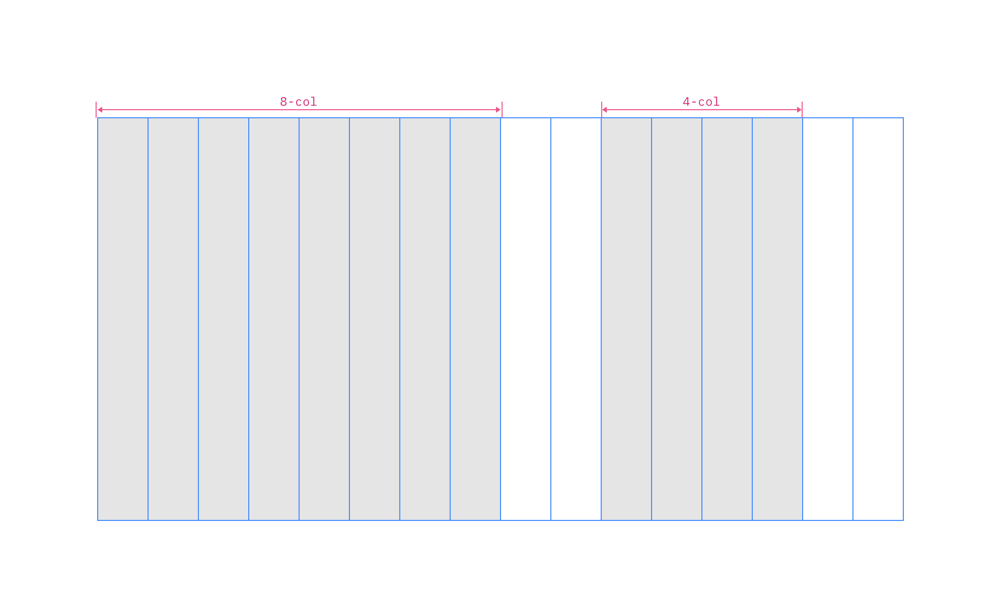
 

**Left panel with images**

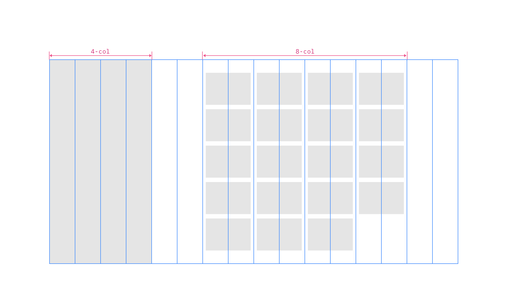
 

### Engineered
* Nothing is arbitrary; all decisions are made according to systematic logic.
* Elements are aligned to each other as well as the underlying grid.
* Aesthetic is delicate, precise, and based on geometry.
* Measurements, shapes, ratios, and proportions are repeated for consistency and quality.

**4x4**

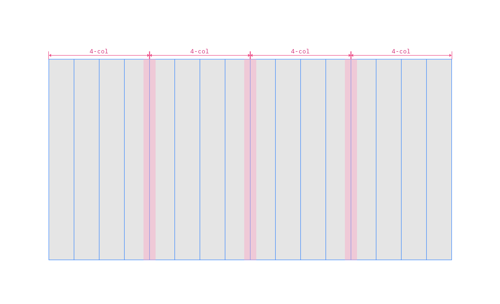
 

**Cards, all in with left-aligned heading**

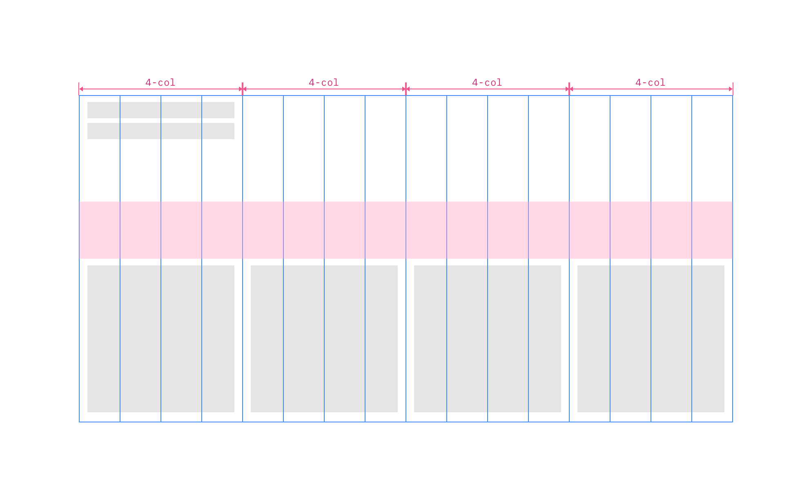
 

**Cards, five up**

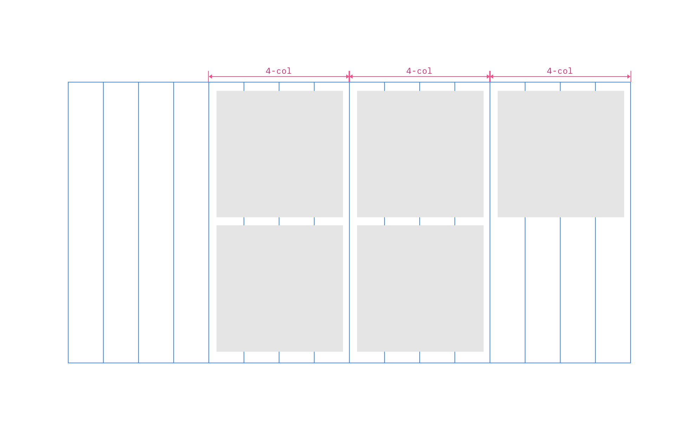

 

**Horizontal stacking**

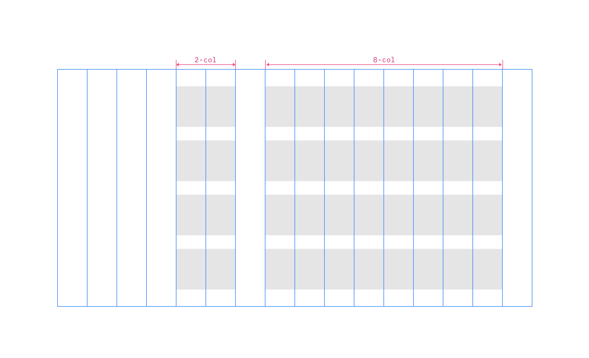

 

## 2x grid best practices (and things to avoid)
Here are some recommendations for how you can effectively use the 2x grid when creating layout patterns.

 

When using the 2x grid there are many things to avoid. In order to establish consistency across IBM.com, we suggest avoiding these types of layouts.

## Final considerations
As you start to design and adopt layout patterns, be sure to reflect on the following statements. Use these to guide your understanding, decision making and application of pattern best practices.

* Layout patterns should be tried and tested
* Layout patterns should be flexible yet consistent
* Layout patterns should be prescriptive, not dogmatic
* Layout patterns should be inclusive and scalable
* Layout patterns should be guided by user intent

