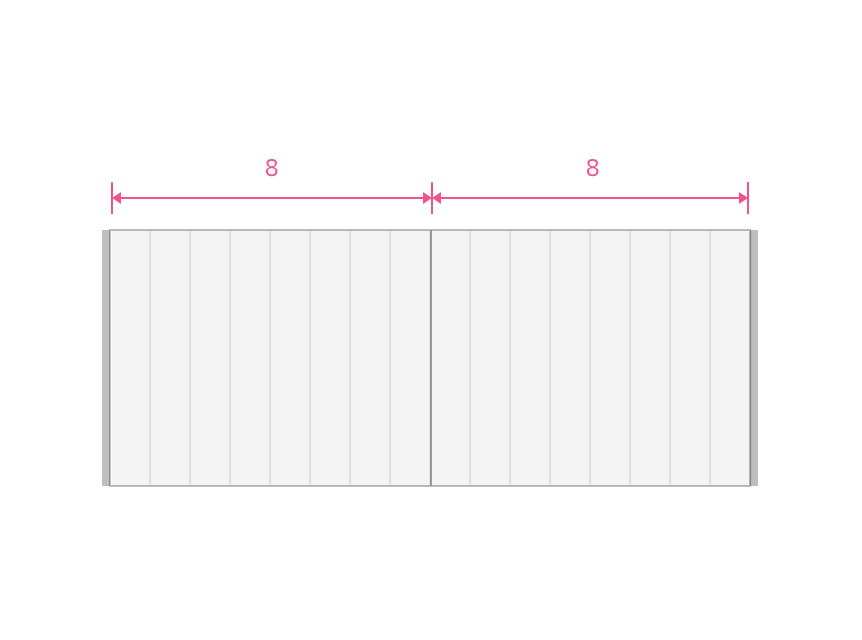
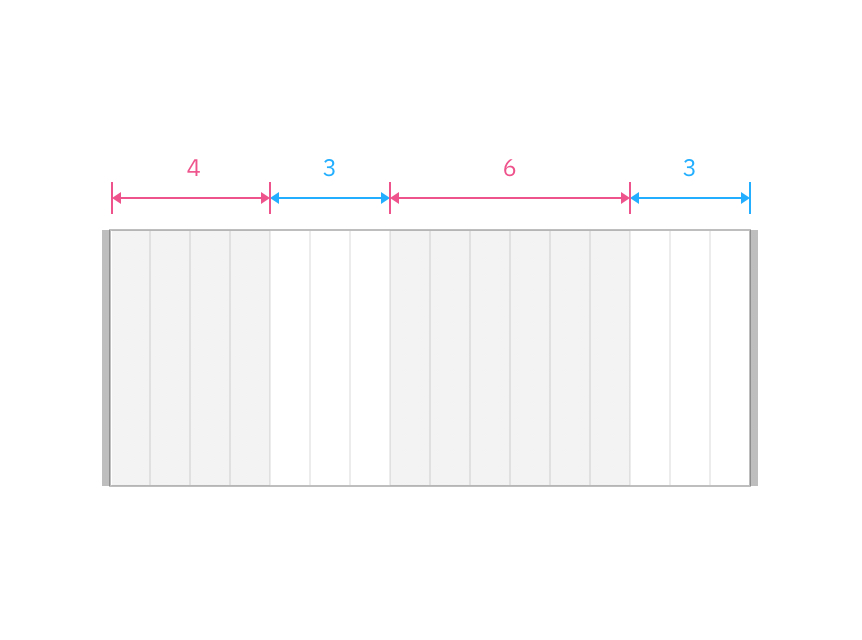

_The following guidelines and layout patterns have been created for DGC squads and approved innovators. Coming soon, Drupal templates with preconfigured layout patterns will be available for all creators of ibm.com pages to use._

<PageDescription>

A good layout helps users navigate complex information, understand the content presented, and complete their goals. This is achieved by organizing and arranging various elements using tools such as the 2x grid, visual anchors, typography and motion, among others.

Our layout patterns show some of the common layouts used in IBM's digital space. They were carefully designed to communicate prescribed content types and are expressions of IBM's distinct brand ethos.

</PageDescription>

 

## Designing and adopting a layout pattern

On every page there is a story that ends with a desired action – one that enables a user to achieve a goal or reach an outcome. A layout pattern is just one building block that allows a user to form a mental model of the story, identify relevant content, and pursue their objective.

### Fit for purpose
Always start with the content and user goals. Consider the purpose of the content and the best type of experience to help the user reach their objective. Is it a long reading experience? Or a collection of short content pieces that will drive the users to the next step? Will the pattern be part of a functional page where the users must process and interact with complex or dense information? Each type of experience and purpose may require a different layout.

### 2x Grid
Always follow the 2x grid to establish zones and structure. A clean layout that is reinforced by steady rhythm and unity of elements lowers the cognitive burden for users. Always consider the holistic experience (or page type) before deciding what pattern-level layout is appropriate. Patterns that utilize a different grid system may not work together. Therefore, try to minimize layout variations and choices within a single experience. 

Use the 2x grid to divide your artboard into equal parts and align content effectively.
Arbitrary placement of content results in an unbalanced layout. 

### Content hierarchy
Hierarchy helps users (viewer, reader, audience) to navigate complex concepts and narrative structures without getting confused or lost, and ultimately find what they are looking for. Thoughtful application of type styles, components, and media will allow content to be communicated and prioritized in different ways. Pay attention also to the size and proximity of content pieces within a pattern and between patterns. 

This content block with media pattern shows how various elements can be designed and organized based on their priority and relevance. In this example, type scale, image size, negative space, and component usage all play an important role in defining the content hierarchy. 

Large type is used to highlight the topic headline and main description. The generous use of space above and below makes this content even more prominent. 
Medium type, in combination with a large image, suggests that this area is key to the preceding and subsequent information.
Paragraphs are set at the smallest type size and can accommodate details to support the overall narrative.
A card placed at the bottom of this content block signifies that there is additional information to be discovered and is used to drive users to that destination. 

### Grouping and spacing
Express relationships between content pieces by grouping and spacing them properly. The density of information should also influence how closely or tightly elements are grouped and spaced.  

Combine related information and content types then space appropriately to highlight dependencies or similarities. 
Without proper organization of content and use of space to separate elements, it is difficult to perceive how one content piece relates to another.

In this pattern, groups of related content and spacial affordances improves the scannability and ease of navigation across the layout.

### Typographic structure / detailing
The visual hierarchy of a pattern can be made clear by using the right typography. Understand the content model and relationships between different elements to establish the right type scale and weight for your pattern. Ensure that type is flush left, line length is carefully considered and adjustments are made based on the content. If it's a reading-centric experience, use 16px as the base type size. Text-based components, such as links or buttons, can be used strategically to further emphasize important information. 

This content group pattern demonstrates how typography of different scales, weight and color can be used to create visual hierarchy.
Expressive-heading-05 is used here to give the headline copy highest priority.
Expressive-heading-03 takes second level hierarchy as it is the second largest type scale.
Text + icon component is placed at the bottom of the text block as it is the final action for the user. Although set at the smallest type size and weight, the use of color highlights the importance of this content. 
Heading-02 acts as an indicator to support the main headline and orient the user but does not take utmost priority in the overall layout.

Learn about IBM's typeface Plex and type basics here.

### Contrast
Contrast is an effective way to distinguish content pieces, engage users, highlight important information, and express IBM's brand elements. Juxtaposing text with image, pairing components and elements of different sizes, strategic use of the grid, negative space and asymmetry are some of the ways in which you can introduce contrast to layout patterns.

Arranging elements of different sizes and types side-by-side elicits a sense of drama through contrast.
When all content is designed and organized in the same way the layout becomes tiresome and indistinct.

The lead space pattern shows how the use of scale and juxtaposition of type and image can be used to emphasize messaging and create clear calls-to-action. 

This cards – with images pattern utilizes asymmetry to arrange essential content in a single area. 

## Creating pages with layout patterns

Layout patterns, when combined together in a particular way, can be used to form many different page types across ibm.com. Some of the most common page types include editorial, navigational, and transactional. When designing or adopting a layout pattern, it is important to consider the purpose of both the content and the purpose of the page where the pattern will be displayed. 

### Key moments
Thoughtful implementation of the above devices including hierarchy, contrast, and rhythm helps to create key moments within a layout. Key moments such as primary call-to-actions are critical for engaging users and driving them toward their desired destination. 

### Enhanced reading / editorial / storytelling (wip title) 
There are many ways in which users read and consume information on a page. When reading English, for example, users read from left to right. When reading dense, text-based content users will often scan from left to right and then continue down the left side of the page, seeking relevant information along the way. Depending on the level of information presented on a page, readers will assume a different reading model. As you begin to stack one pattern on top of another, understanding common reading conventions will help you design an overall layout that keeps your users engaged. 

Careful use of negative space, hierarchy, and alignment will enhance the reading experience and focus areas from pattern to pattern.
Overly complex and dense pages do not accommodate natural reading habits and increase cognitive load.

### Repetition, continuity and consistency
No pattern exists on its own. Pay attention to how individual layout patterns fit into the larger context of both the page type and the broader user journey across IBM.com. Although patterns are reusable, try to avoid repeating the same pattern in sequence, unless it is necessary. This can result in a monotonous experience for users. At the same time, there should be a consistent visual flow and placement of elements as the user moves across each touch-point. 

**Repetition**
When stacked, patterns with a consistent grid structure but diverse layout and content types can create a dynamic and engaging page-level experience.
When the same pattern is repeated multiple times, the user experience becomes restricted and the layout visually uninteresting.

**Continuity**
Using the same pattern for similar touch-points across multiple pages can provide a sense of continuity and familiarity for the user. 

**Consistency**
Notice the consistent spacial model and placement of content above. Similar elements and items share the same vertical and horizontal starting points across patterns and pages. This helps to unify the offering experience when there are multiple pages or steps involved in a single journey. It also keeps the user oriented as they explore.

When there is no consistent visual flow, spacial model or alignment of content from pattern to pattern and from page to page, the overall experience becomes fragmented and disconnected.

## Additional resources

<Row className="resource-card-group">
  <Column colMd={4} colLg={4} noGutterSm>
    <ResourceCard
      subTitle="Learn more about 2x Grid best practices for digital"           
      href="#"
    >

      
</ResourceCard>
  </Column>
  
   <Column colMd={4} colLg={4} noGutterSm>
    <ResourceCard
      subTitle="Explore Carbon patterns"          
      href="#"
    >

      
</ResourceCard>
  </Column>
  
   <Column colMd={4} colLg={4} noGutterSm>
    <ResourceCard
      subTitle="View IBM Design Language layout principles "         
      href="#"
    >

      
</ResourceCard>
  </Column>
  

</Row>

## Final considerations

Reflect on the following statements as you start to design and adopt layout patterns. Use these to guide your understanding, decision making and application of pattern best practices.

### Guided by user intent
Pay attention to the behaviors, goals and actions of end-users when identifying, creating and adopting the right pattern.

### Expressions of IBM's brand
Successful execution of layout is essential to achieving the IBM look across all visual touch-points.

### Tried and tested
Test patterns with real users to ensure the design meets their needs.

### Prescriptive, not dogmatic
Specifications and usage guidance must be detailed and clear but, when applicable, should not limit creativity or innovation.

### Inclusive and scalable
To improve efficiency, consistency and scalability, patterns should be available for other teams to adopt.

 
 
 
 
 
 
 
 
 
 

## 2x grid best practices (and things to avoid)
Here are some recommendations for how you can effectively use the 2x grid when creating layout patterns.

 

<Row>
<Column colMd={4} colLg={4} >
  <DoDontExample type="do" >

  </DoDontExample>
</Column>  
<Column colMd={4} colLg={4}>
  <DoDontExample type="do" >

  </DoDontExample>
</Column>
</Row>

<Row>
<Column colMd={4} colLg={4} >
  <DoDontExample type="do" >

  </DoDontExample>
</Column>  
<Column colMd={4} colLg={4}>
  <DoDontExample type="do" >

  </DoDontExample>
</Column>
</Row>

<Row>
<Column colMd={4} colLg={4} >
  <DoDontExample type="do" >

  </DoDontExample>
</Column>  
<Column colMd={4} colLg={4}>
  <DoDontExample type="do" >

  </DoDontExample>
</Column>
</Row>

<Row>
<Column colMd={4} colLg={4} >
  <DoDontExample type="do" >

  </DoDontExample>
</Column>  
<Column colMd={4} colLg={4}>
  <DoDontExample type="do" >

  </DoDontExample>
</Column>
</Row>

<Row>
<Column colMd={4} colLg={4} >
  <DoDontExample type="do" >

  </DoDontExample>
</Column>  
<Column colMd={4} colLg={4}>
  <DoDontExample type="do" >

  </DoDontExample>
</Column>
</Row>

<Row>
<Column colMd={4} colLg={4} >
  <DoDontExample type="do" >

  </DoDontExample>
</Column>  
<Column colMd={4} colLg={4}>
  <DoDontExample type="do" >

  </DoDontExample>
</Column>
</Row>

<Row>
<Column colMd={4} colLg={4} >
  <DoDontExample type="do" >

  </DoDontExample>
</Column>  
<Column colMd={4} colLg={4}>
  <DoDontExample type="do" >

  </DoDontExample>
</Column>
</Row>

<Row>
<Column colMd={4} colLg={4} >
  <DoDontExample type="do" >

  </DoDontExample>
</Column>  
<Column colMd={4} colLg={4}>
  <DoDontExample type="do" >

  </DoDontExample>
</Column>
</Row>

 

 

When using the 2x grid there are many things to avoid. In order to establish consistency across IBM.com, we suggest avoiding these types of layouts.

<Row>
<Column colMd={4} colLg={4} >
  <DoDontExample >

  </DoDontExample>
</Column>  
<Column colMd={4} colLg={4}>
  <DoDontExample >

  </DoDontExample>
</Column>
</Row>

<Row>
<Column colMd={4} colLg={4} >
  <DoDontExample  >

  </DoDontExample>
</Column>  
<Column colMd={4} colLg={4}>
  <DoDontExample >

  </DoDontExample>
</Column>
</Row>

<Row>
<Column colMd={4} colLg={4} >
  <DoDontExample >

  </DoDontExample>
</Column>  
<Column colMd={4} colLg={4}>
  <DoDontExample >

  </DoDontExample>
</Column>
</Row>

<Row>
<Column colMd={4} colLg={4} >
  <DoDontExample >

  </DoDontExample>
</Column>  
<Column colMd={4} colLg={4}>
  <DoDontExample >

  </DoDontExample>
</Column>
</Row>

 

## Applying layout principles

By leading with [IBM Design Language layout principles](https://www.ibm.com/design/language/layout/overview/) when designing patterns, we move closer to achieving a consistent tone of voice and brand expression across all of IBM's platforms. 

## Final considerations

As you start to design and adopt layout patterns, be sure to reflect on the following statements. Use these to guide your understanding, decision making and application of pattern best practices.
 

* Layout patterns should be tried and tested
* Layout patterns should be flexible yet consistent
* Layout patterns should be prescriptive, not dogmatic
* Layout patterns should be inclusive and scalable
* Layout patterns should be guided by user intent

