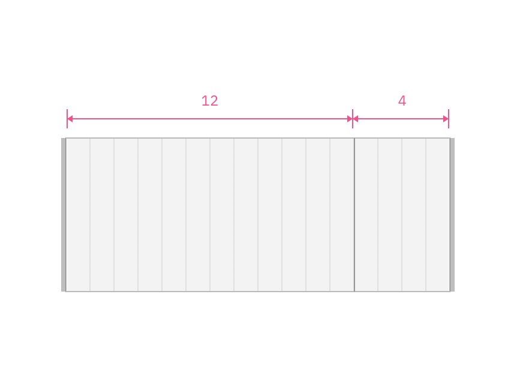
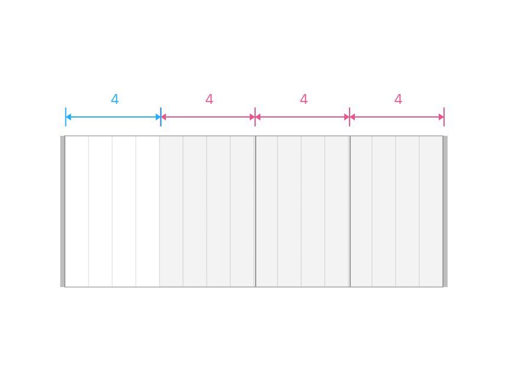
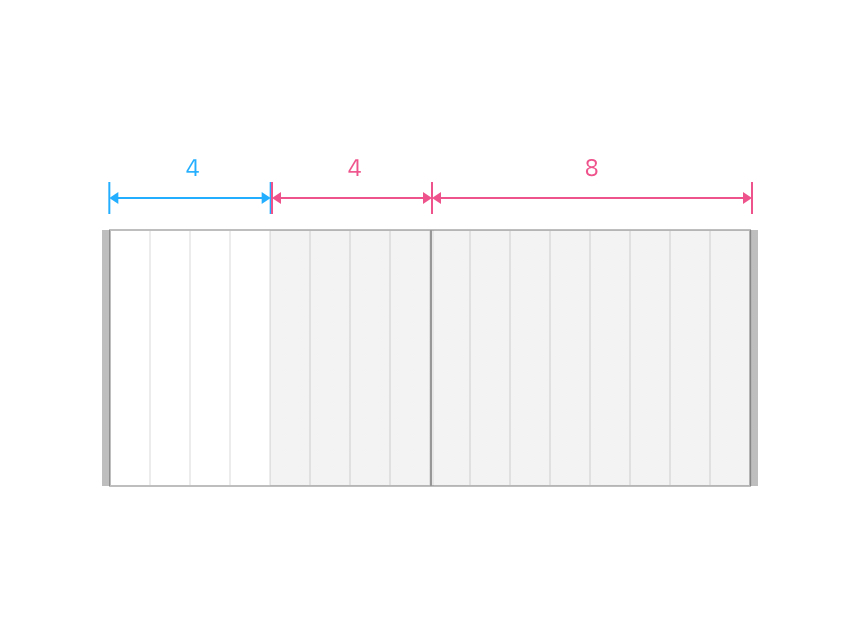

_The following guidelines and layout patterns have been created for DGC squads and approved innovators. Coming soon, Drupal templates with preconfigured layout patterns will be available for all creators of ibm.com pages to use._

<PageDescription>

A good layout helps users navigate complex information, understand the content presented, and complete their goals. This is achieved by organizing and arranging various elements using tools such as the 2x grid, visual anchors, typography and motion, among others.

Our layout patterns show some of the common layouts used in IBM's digital space. They were carefully designed to communicate prescribed content types and are expressions of IBM's distinct brand ethos.

</PageDescription>

## Layout patterns

| Name              | Status                                                                                                             |
 | ---------------------------------------------- | ------------------------------------------------------------------------------------------------------------ |
| Card section – simple     | <pre>Under construction</pre> |
| Card section – with images     | <pre>Under construction</pre> |
| Content block – mixed groups     | <pre>Under construction</pre> |
| Content block – segmented    | <pre>Under construction</pre> |
| Content block – simple     | <pre>Under construction</pre> |
| Content block – with media     | <pre>Under construction</pre> |
| Content group – with cards     | <pre>Under construction</pre> |
| Content group – with pictograms     | <pre>Under construction</pre> |
| Content group – simple     | <pre>Under construction</pre> |
| Feature card     | <pre>Under construction</pre> |
| Lead space | <pre>Experimental</pre> |

## Designing and adopting a layout pattern
On every page there is a story that ends with a desired action – one that enables a user to achieve a goal or reach an outcome. A layout pattern is just one building block that allows a user to form a mental model of the story, identify relevant content, and pursue their objective.

### Fit for purpose
Always start with the content and user goals. Consider the purpose of the content and the best type of experience to help the user reach their objective. Is it a long reading experience? Or a collection of short content pieces that will drive the users to the next step? Will the pattern be part of a functional page where the users must process and interact with complex or dense information? Each type of experience and purpose may require a different layout.

### 2x Grid
Always follow the 2x grid to establish zones and structure. A clean layout that is reinforced by steady rhythm and unity of elements lowers the cognitive burden for users. Always consider the holistic experience (or page type) before deciding what pattern-level layout is appropriate. Patterns that utilize a different grid system may not work together. Therefore, try to minimize layout variations and choices within a single experience. 

### Content hierarchy
Hierarchy helps users (viewer, reader, audience) to navigate complex concepts and narrative structures without getting confused or lost, and ultimately find what they are looking for. Thoughtful application of type styles, components, and media will allow content to be communicated and prioritized in different ways. Pay attention also to the size and proximity of content pieces within a pattern and between patterns. 

### Grouping and spacing
Express relationships between content pieces by grouping and spacing them properly. The density of information should also influence how closely or tightly elements are grouped and spaced. 

## 2x grid best practices (and things to avoid)
Here are some recommendations for how you can effectively use the 2x grid when creating layout patterns.

 

<Row>
<Column colMd={4} colLg={4} >
  <DoDontExample type="do" >

  </DoDontExample>
</Column>  
<Column colMd={4} colLg={4}>
  <DoDontExample type="do" >

  </DoDontExample>
</Column>
</Row>

<Row>
<Column colMd={4} colLg={4} >
  <DoDontExample type="do" >

  </DoDontExample>
</Column>  
<Column colMd={4} colLg={4}>
  <DoDontExample type="do" >

  </DoDontExample>
</Column>
</Row>

<Row>
<Column colMd={4} colLg={4} >
  <DoDontExample type="do" >

  </DoDontExample>
</Column>  
<Column colMd={4} colLg={4}>
  <DoDontExample type="do" >

  </DoDontExample>
</Column>
</Row>

<Row>
<Column colMd={4} colLg={4} >
  <DoDontExample type="do" >

  </DoDontExample>
</Column>  
<Column colMd={4} colLg={4}>
  <DoDontExample type="do" >

  </DoDontExample>
</Column>
</Row>

<Row>
<Column colMd={4} colLg={4} >
  <DoDontExample type="do" >

  </DoDontExample>
</Column>  
<Column colMd={4} colLg={4}>
  <DoDontExample type="do" >

  </DoDontExample>
</Column>
</Row>

<Row>
<Column colMd={4} colLg={4} >
  <DoDontExample type="do" >

  </DoDontExample>
</Column>  
<Column colMd={4} colLg={4}>
  <DoDontExample type="do" >

  </DoDontExample>
</Column>
</Row>

<Row>
<Column colMd={4} colLg={4} >
  <DoDontExample type="do" >

  </DoDontExample>
</Column>  
<Column colMd={4} colLg={4}>
  <DoDontExample type="do" >

  </DoDontExample>
</Column>
</Row>

<Row>
<Column colMd={4} colLg={4} >
  <DoDontExample type="do" >

  </DoDontExample>
</Column>  
<Column colMd={4} colLg={4}>
  <DoDontExample type="do" >

  </DoDontExample>
</Column>
</Row>

 

 

When using the 2x grid there are many things to avoid. In order to establish consistency across IBM.com, we suggest avoiding these types of layouts.

<Row>
<Column colMd={4} colLg={4} >
  <DoDontExample >

  </DoDontExample>
</Column>  
<Column colMd={4} colLg={4}>
  <DoDontExample >

  </DoDontExample>
</Column>
</Row>

<Row>
<Column colMd={4} colLg={4} >
  <DoDontExample  >

  </DoDontExample>
</Column>  
<Column colMd={4} colLg={4}>
  <DoDontExample >

  </DoDontExample>
</Column>
</Row>

<Row>
<Column colMd={4} colLg={4} >
  <DoDontExample >

  </DoDontExample>
</Column>  
<Column colMd={4} colLg={4}>
  <DoDontExample >

  </DoDontExample>
</Column>
</Row>

<Row>
<Column colMd={4} colLg={4} >
  <DoDontExample >

  </DoDontExample>
</Column>  
<Column colMd={4} colLg={4}>
  <DoDontExample >

  </DoDontExample>
</Column>
</Row>

 

## Applying layout principles

By leading with [IBM Design Language layout principles](https://www.ibm.com/design/language/layout/overview/) when designing patterns, we move closer to achieving a consistent tone of voice and brand expression across all of IBM's platforms. 

## Final considerations

As you start to design and adopt layout patterns, be sure to reflect on the following statements. Use these to guide your understanding, decision making and application of pattern best practices.
 

* Layout patterns should be tried and tested
* Layout patterns should be flexible yet consistent
* Layout patterns should be prescriptive, not dogmatic
* Layout patterns should be inclusive and scalable
* Layout patterns should be guided by user intent

