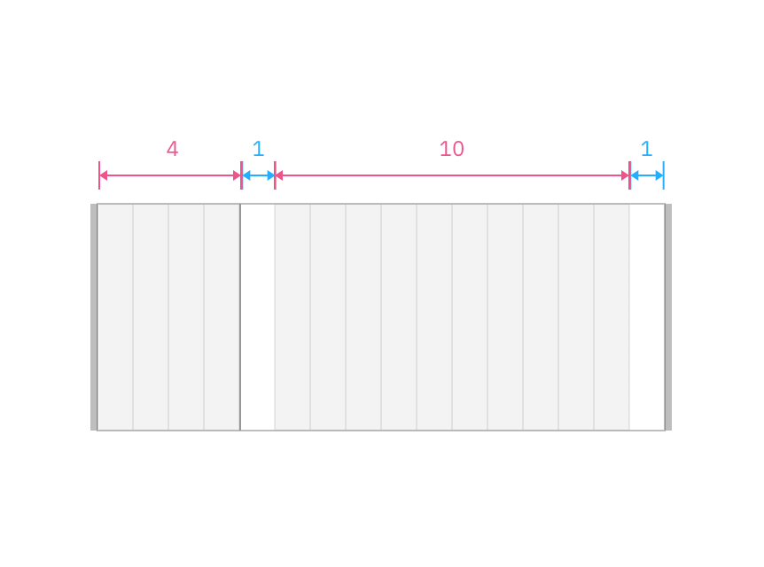
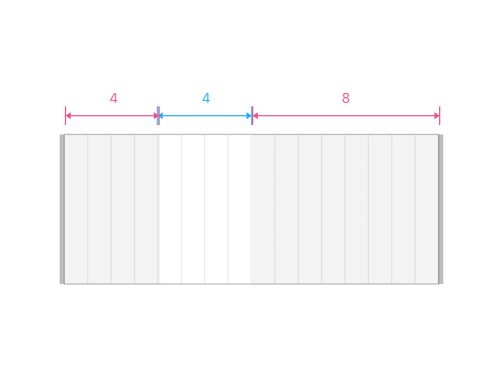

<PageDescription>

Layout patterns show the many ways in which content can be arranged using the 2x grid. They are used to render prescribed content types in different ways, in response to user needs. Layout patterns help to form the appropriate page structure and user flow in a visually pleasing manner and are authorable by a CMS user.

</PageDescription>

 

## Resources

<Row className="resource-card-group">
<Column colMd={4} colLg={4} noGutterSm>
    <ResourceCard
      subTitle="IBM.com Library Patterns React Storybook – experimental"
      aspectRatio="2:1"
      actionIcon="launch"
      href="https://ibmdotcom-patterns-react-experimental.mybluemix.net/?path=/story/*"
      >

 
</ResourceCard>
</Column>
</Row>

 

## Layout patterns

| Name              | Status                                                                                                             |
 | ---------------------------------------------- | ------------------------------------------------------------------------------------------------------------ |
| Array with cards     | <pre>Experimental</pre> |
| Array with pictograms | <pre>Experimental</pre> |
| [Lead space – left-aligned](/patterns/leadspace) | <pre>Experimental</pre> |
| [Lead space – centered](/patterns/leadspace) | <pre>Experimental</pre> |
| Logo grid | <pre>Under construction</pre> |
| Rich overview | <pre>Under construction</pre> |
| Simple array | <pre>Under construction</pre> |
| Simple benefits | <pre>Under construction</pre> |
| Simple long-form | <pre>Experimental</pre> |
| Simple overview | <pre>Experimental</pre> |
| Testimonials | <pre>Under construction</pre> |
| Use cases | <pre>Experimental</pre> |

## 2x grid best practices (and things to avoid)
Here are some recommendations for how you can effectively use the 2x grid when creating layout patterns.

 

<Row>
<Column colMd={4} colLg={4} >
  <DoDontExample type="do" >

  </DoDontExample>
</Column>  
<Column colMd={4} colLg={4}>
  <DoDontExample type="do" >

  </DoDontExample>
</Column>
</Row>

<Row>
<Column colMd={4} colLg={4} >
  <DoDontExample type="do" >

  </DoDontExample>
</Column>  
<Column colMd={4} colLg={4}>
  <DoDontExample type="do" >

  </DoDontExample>
</Column>
</Row>

<Row>
<Column colMd={4} colLg={4} >
  <DoDontExample type="do" >

  </DoDontExample>
</Column>  
<Column colMd={4} colLg={4}>
  <DoDontExample type="do" >

  </DoDontExample>
</Column>
</Row>

<Row>
<Column colMd={4} colLg={4} >
  <DoDontExample type="do" >

  </DoDontExample>
</Column>  
<Column colMd={4} colLg={4}>
  <DoDontExample type="do" >

  </DoDontExample>
</Column>
</Row>

<Row>
<Column colMd={4} colLg={4} >
  <DoDontExample type="do" >

  </DoDontExample>
</Column>  
<Column colMd={4} colLg={4}>
  <DoDontExample type="do" >

  </DoDontExample>
</Column>
</Row>

<Row>
<Column colMd={4} colLg={4} >
  <DoDontExample type="do" >

  </DoDontExample>
</Column>  
<Column colMd={4} colLg={4}>
  <DoDontExample type="do" >

  </DoDontExample>
</Column>
</Row>

<Row>
<Column colMd={4} colLg={4} >
  <DoDontExample type="do" >

  </DoDontExample>
</Column>  
<Column colMd={4} colLg={4}>
  <DoDontExample type="do" >

  </DoDontExample>
</Column>
</Row>

<Row>
<Column colMd={4} colLg={4} >
  <DoDontExample type="do" >

  </DoDontExample>
</Column>  
<Column colMd={4} colLg={4}>
  <DoDontExample type="do" >

  </DoDontExample>
</Column>
</Row>

 

 

When using the 2x grid there are many things to avoid. In order to establish consistency across IBM.com, we suggest avoiding these types of layouts.

<Row>
<Column colMd={4} colLg={4} >
  <DoDontExample >

  </DoDontExample>
</Column>  
<Column colMd={4} colLg={4}>
  <DoDontExample >

  </DoDontExample>
</Column>
</Row>

<Row>
<Column colMd={4} colLg={4} >
  <DoDontExample  >

  </DoDontExample>
</Column>  
<Column colMd={4} colLg={4}>
  <DoDontExample >

  </DoDontExample>
</Column>
</Row>

<Row>
<Column colMd={4} colLg={4} >
  <DoDontExample >

  </DoDontExample>
</Column>  
<Column colMd={4} colLg={4}>
  <DoDontExample >

  </DoDontExample>
</Column>
</Row>

<Row>
<Column colMd={4} colLg={4} >
  <DoDontExample >

  </DoDontExample>
</Column>  
<Column colMd={4} colLg={4}>
  <DoDontExample >

  </DoDontExample>
</Column>
</Row>

 

## Applying layout principles

By leading with [IBM Design Language layout principles](https://www.ibm.com/design/language/layout/overview/) when designing patterns, we move closer to achieving a consistent tone of voice and brand expression across all of IBM's platforms. 

## Final considerations

As you start to design and adopt layout patterns, be sure to reflect on the following statements. Use these to guide your understanding, decision making and application of pattern best practices.
 

* Layout patterns should be tried and tested
* Layout patterns should be flexible yet consistent
* Layout patterns should be prescriptive, not dogmatic
* Layout patterns should be inclusive and scalable
* Layout patterns should be guided by user intent

