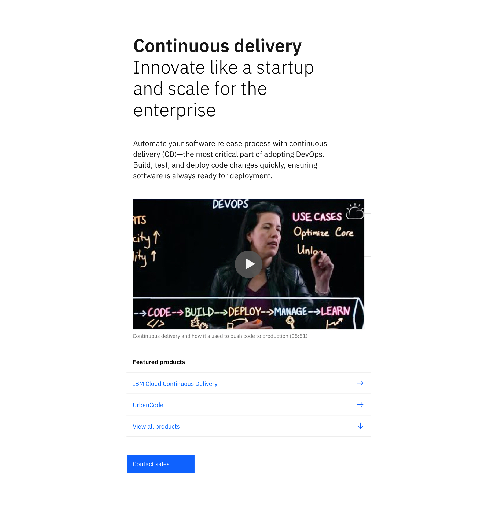

<PageDescription>

The Lead space &mdash; block is an alternative to the [Lead space](https://www.ibm.com/standards/web/ibm-dotcom-library/patterns/leadspace), enabling a more productive first site of viewer engagement. 

The Lead space &mdash; block is positioned at the top of a web page, with a purpose to orient the user when they land on a page, inform them of the content, and guide them to the first key piece of content on the page, whether it’s a crucial piece of information or a call-to-action button.

</PageDescription>

<AnchorLinks>

<AnchorLink>Default</AnchorLink>
<AnchorLink>Development documentation</AnchorLink>
<AnchorLink>Design and functional specifications</AnchorLink>
<AnchorLink>Feedback</AnchorLink>

</AnchorLinks>

## Default
When designed and implemented effectively, the Lead space &mdash; block can be used to engage visitors immediately in one of the most important moments in the user’s journey through a complex web environment.

This pattern includes a headline, subheadline, supporting message, Link list and a call to action. There is also the option to add media in the form of an image or video.

## Development documentation

| Language      | Status        | Sandbox                                                                              |
| ------------- | -----------   | ------------------------------------------------------------------------             |
| React         | 
<pre>Stable</pre>
        | <a href="hhttps://ibmdotcom-react.mybluemix.net/?path=/story/components-leadspaceblock--default" target="_blank">View storybook</a>    |
| Vanilla       | 
<pre>Under construction</pre>
  |

## Design and functional specifications

The design specs and functional specs for the Lead space &mdash; block can be viewed  <a href="https://ibm.box.com/s/kisml8o6mgrexlvqaa3cv20z1e32sbli" target="_blank">here</a>

## Feedback

Help us improve this component by providing feedback, asking questions, and leaving any other comments on <a href="https://github.com/carbon-design-system/ibm-dotcom-library" target="_blank">GitHub</a>.
