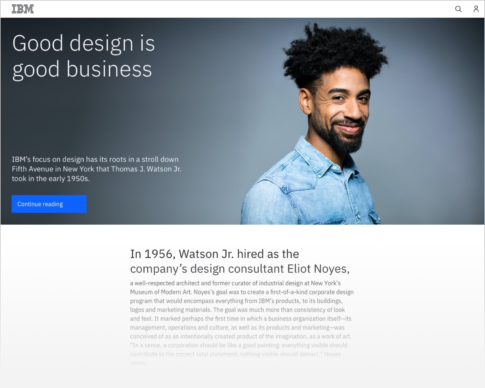
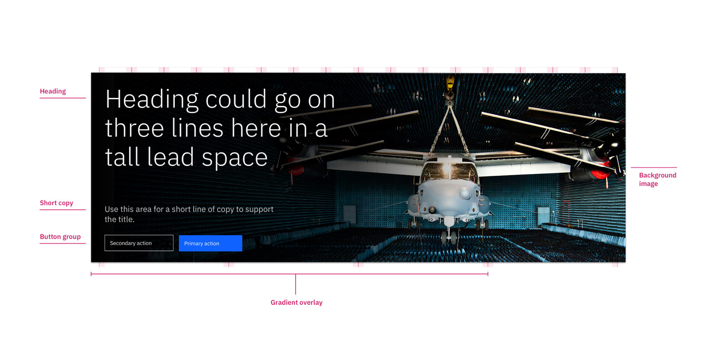
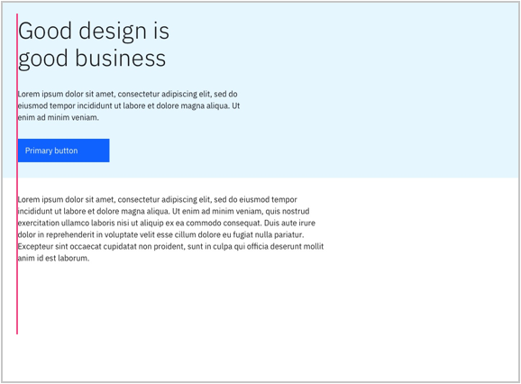
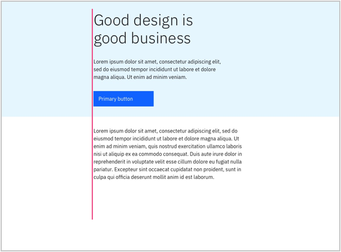
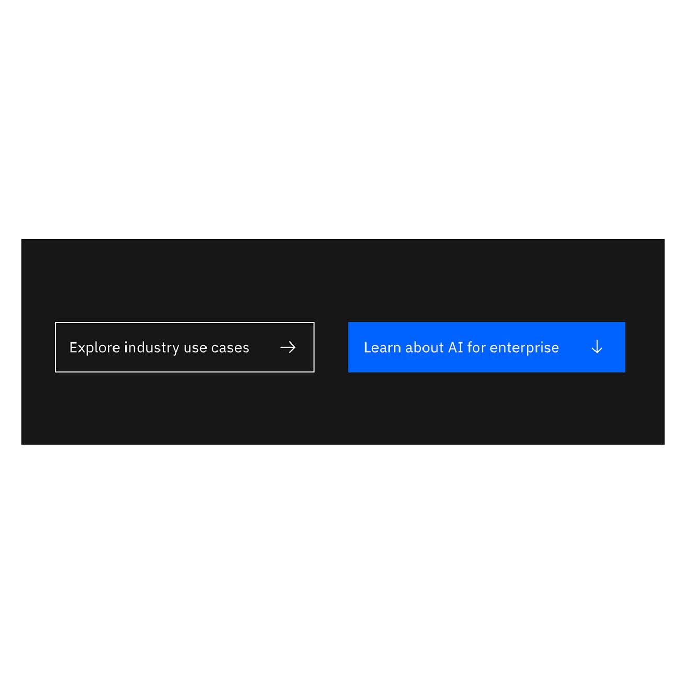
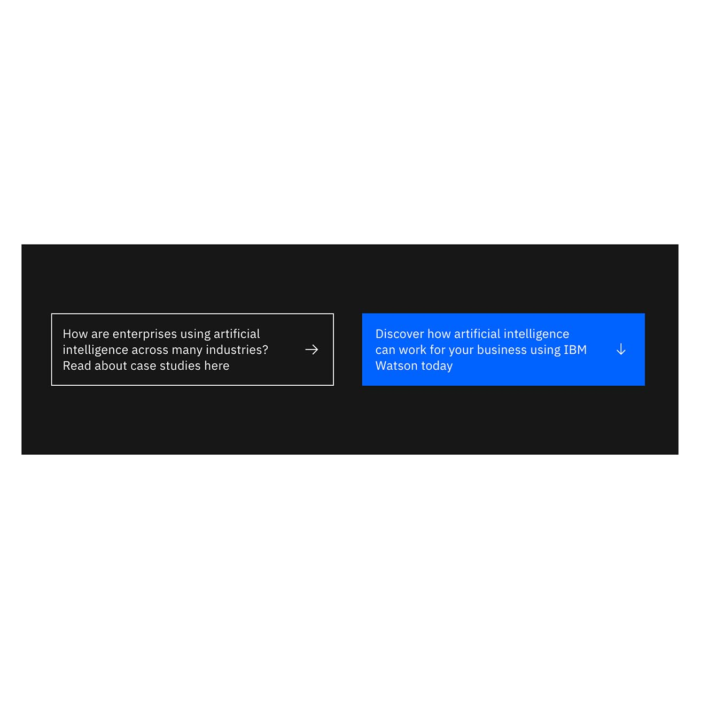
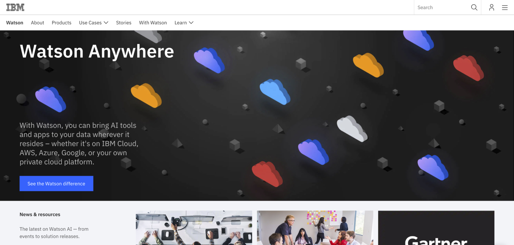
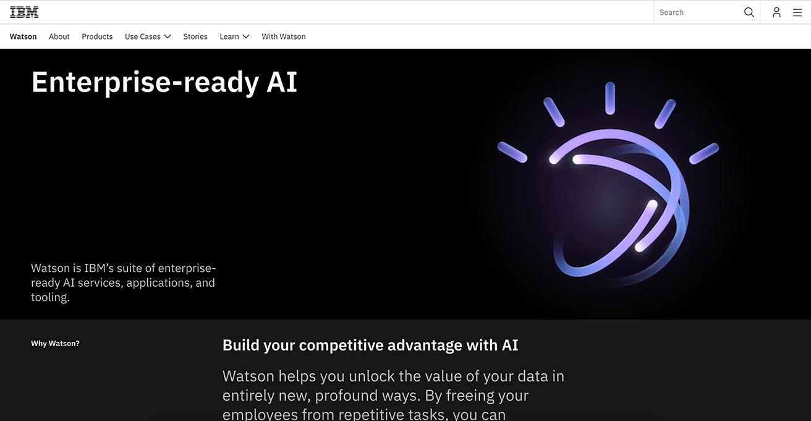
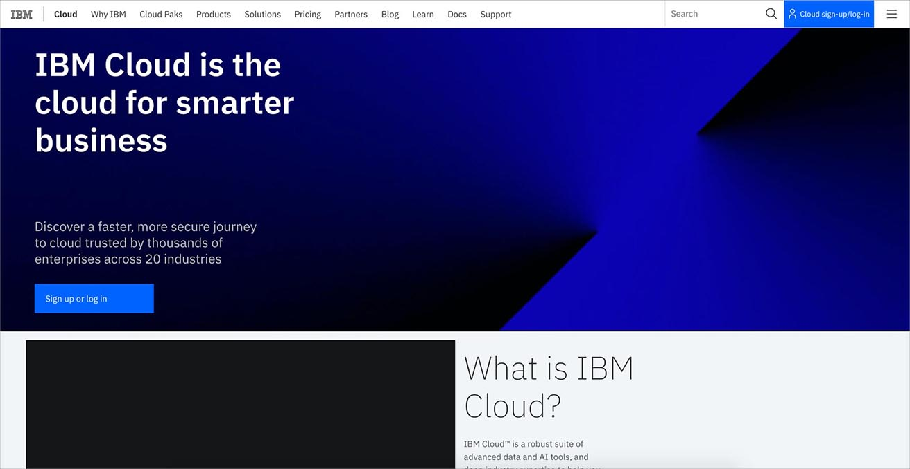

<PageDescription>

The lead space is positioned at the top of a web page and serves as the first site of user engagement. Its primary purpose is to orient the user when they land on a page, inform them of the content, and guide them to the first key piece of content on the page, whether it's a crucial piece of information or a call-to-action.

</PageDescription>

 

<Row>
<Column colMd={8} colLg={8} >

</Column>
</Row>

<AnchorLinks>

<AnchorLink>Overview</AnchorLink>
<AnchorLink>Anatomy</AnchorLink>
<AnchorLink>Layout</AnchorLink>
<AnchorLink>Height standards</AnchorLink>
<AnchorLink>Content</AnchorLink>
<AnchorLink>Imagery</AnchorLink>
<AnchorLink>Call to action</AnchorLink>
<AnchorLink>Pattern in use</AnchorLink>
<AnchorLink>Related components and patterns</AnchorLink>

</AnchorLinks>

<InlineNotification>

**Note that button group has been updated:** the primary button will appear first, followed by the tertiary button. All example images with two buttons are outdated, please reference the [Lead space storybook](https://www.ibm.com/standards/carbon/web-components/?path=/story/components-lead-space--super) for live examples.

</InlineNotification>

## Overview

When designed and implemented effectively, the lead space can be used to engage visitors immediately in one of the most important moments in the user’s journey through a complex web environment. It is the first section below the [masthead](/components/masthead) and can include a background image or video, headline, supporting message and call to action to accommodate user needs.

## Anatomy

Here are some of the elements that are commonly used and currently available.

## Layout

### Best practices

Here are some best practices for designing an effective layout for lead space:

- The headline should orient the user on what the page is about.
- The copy below the headline should have a clear relationship to the headline.
- Buttons are positioned after the headline and the copy.
- Image should be relevent to the content of the page. For more details, see the [Imagery section](#imagery).

For more information on the different lead space options, please see [Related components and patterns](#related-components-and-patterns).

### Content alignment

On IBM.com pages, there are two layout options&mdash;left-aligned and center-aligned. Follow these guidelines to select the right layout for your page.

1. Align to the primary content of the given page.

2. When there is a background image in the Lead space, using the left-aligned lead space is recommended regardless of the primary content alignment.

<Row>
<Column colMd={4} colLg={4} >

</Column>
<Column colMd={4} colLg={4} >

</Column>
<Column colMd={4} colLg={4} >

</Column>
</Row>

## Height standards

### Lead space left-aligned

The size of a left-align lead space height usually reflects the intent of the page and sets the right expectation for the user. Choose from these heights for the different purposes and use cases.

| Name   | Height | Recommended usage                                                                      |
| :----- | :----- | :------------------------------------------------------------------------------------- |
| Super  | 640px  | Brand or immersive experience pages                                                    |
| Tall   | 560px  | High level and messaging pages                                                         |
| Medium | 480px  | Functional or navigational pages                                                       |
| Short  | 320px  | Minimal and utilitarian. This lead space does not allow a button group and short copy. |

### Lead space centered

Lead space centered does not have fixed heights. It is ideal for objective statements, such as academic research titles, and problem solving clues, such as “_Find a product_” or “_Let's troubleshoot_”. If you want to transmit a more marketing-oriented message, please use the left-aligned lead space option.

## Content

- Copy in the lead space creates an immediate impact while informing web visitors about the page or service quickly and effectively.
- Copy should be brief and relevant. This will help to orient and inform the user as quickly as possible.
- Don’t rely on the lead space to deliver the majority of the messaging and information about your topic or offering. The rest of the page is for delivering your message.
- A lead space is not required for all scenarios; follow the guidance for the page type you are creating.

## Imagery

Images are used to enhance the content or introduce a supporting narrative. There are multiple options to choose from when using imagery in a Lead space. Depending on what you want your users to see and how you want them to feel, you may decide to use different types and styles of imagery. Image types commonly used in a Lead space include:

- Portrait photography
- Landscape photography
- Illustration

Usage: Images should never impact the readability or legibility of the lead space copy.

- Where possible, images should blend into the background to avoid hard lines or optical divisions across the lead space.
- If the background would impact the readibility of the headline or body copy, consider using a gradient overlay to create the proper contrast for the left area of a lead space.
- If using a full-width image in the background, the image should be larger in size than the lead space size, to allow for browser resizing. If you choose this option, include additional padding around the image.
- Only use one image per lead space.

<Row>
<Column colMd={4} colLg={6} >
  <DoDontExample type="do" caption="Use a gradient overlay to ensure maximum readability of text.">

  </DoDontExample>
</Column>  
<Column colMd={4} colLg={6}>
  <DoDontExample caption="The background image should never interfere with the text or call to action buttons.">

  </DoDontExample>
</Column>
</Row>

#### Image sizing

- For a standard screen, the recommended width for a full-width background image is 1400 pixel minimum, and the size should not exceed 200KB.
- For a retina display, the recommended width for a full-width background image is 2800 pixels and the size should not exceed 200KB.

## Call to action

The maximum number of CTAs per lead space is two. Note, however, that it is not required to use a call to action in a lead space.

#### How to use CTA copy

Some CTAs are for truly generic actions (e.g., Log in) but many are not. Copy for any CTA should clearly and succinctly tell users what to expect when they click. For example:

- Generic: Learn more
- Better: Get the step-by-step guide

<Row>
<Column colMd={4} colLg={6} >
<DoDontExample type="do" caption="CTA copy should be informative but brief.">

  </DoDontExample>
</Column>
<Column colMd={4} colLg={6}>
  <DoDontExample caption="Never use sentences for CTAs. ">

  </DoDontExample>
</Column>
</Row>

### Call to action options

#### Single CTA

You may choose to use a single CTA to encourage users to do any of the following, for example:

- Sign up
- Log in
- Register today
- Download the smartpaper

Usage: Use a primary button only. Icon is optional.

Caution: Using a CTA in your lead space will direct your users to a new section, modal or page. 
If you do not want users to leave the page before discovering information below, consider using a lead space without any CTAs. Keep in mind that scroll depth is a valuable KPI; driving users off of your page as soon as they land can be counterproductive.

#### Double CTA

The Double CTA lead space provides two options for users to continue their journey.

Usage: Use a primary and tertiary style button. Icons are optional.

When using a Double CTA, the primary button appears as the first button in the group. The tertiary button appears as the second button.

## Pattern in use

<Caption>
  Lead space left-aligned used to introduce a visitor to Watson and it's usage
  across platforms.
</Caption>

 

<Caption>
  Lead space left-aligned used to introduce a visitor to Watson and it's usage
  across platforms.
</Caption>

 

<Caption>
  Lead space left-aligned used by IBM Cloud for a high-level introduction.
</Caption>

 

<Caption>
  Lead space centered used for a Learn page template. There are no CTAs used
  here.
</Caption>

## Related components and patterns

<Title>Components</Title>

- [Lead space left-aligned](/components/leadspace#variants)
- [Lead space centered](/components/leadspace#centered)
- [Lead space block](/components/lead-space-block)

<Title>Patterns</Title>

- [Call-to-action](../patterns/call-to-action)
- [Cards](../patterns/cards)
