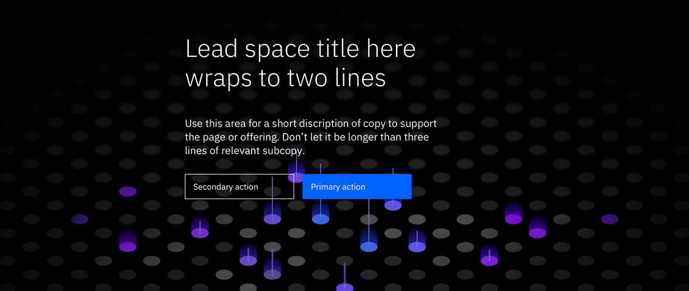

<PageDescription>

A Lead space is positioned at the top of a web page and serves as the first site of viewer engagement. Its primary purpose is to orient the user when they land on a page, inform them of the content, and guide them to the first key piece of content on the page, whether it’s a crucial piece of information or a call-to-action button.

When designed and implemented effectively, the lead space can be used to engage visitors immediately in one of the most important moments in the user’s journey through a complex web environment. It is the first section below the masthead and can include a stylized background, headline, supporting message and call to action to accommodate user needs.

</PageDescription>

<AnchorLinks>

<AnchorLink>Overview</AnchorLink>
<AnchorLink>Dimensions</AnchorLink>
<AnchorLink>Size standards</AnchorLink>
<AnchorLink>Content alignment</AnchorLink>
<AnchorLink>Related components and patterns</AnchorLink>

</AnchorLinks>

## Overview
A compelling lead space can encourage customers to spend time on your website. Depending on the needs of your user and the information you are trying to share, the lead space of your webpage may take different forms.

## Dimensions

Lead spaces are used to enhance the content or introduce a supporting narrative. There are multiple dimensions to consider when designing a Lead space. 

The dimensions for consideration include:

#### Journey segments
Where is the page you are creating in the user journey? Is it in the early, mid, checkout, or post-purchase?

#### Variations within segments per page type
Is the page you are creating for product listing? if not, is it for a business solution or a landing page, etc?

#### Expressive VS productive
Is the page you are creating used for presenting typographical content for users to gain insight or for helping users to focus on a task?

#### Centered VS left-aligned
No matter which segments your offers are in the user journey, always make sure you have a clear understanding of the purpose of the page. See the Content alignment section below for detail.

We are always refining and testing the standards, so please contribute by working with us to refine the standard details.

## Size standards

The curated Lead space size standards are super, tall, regular, short, mini. Choose the right size for the purpose of the Lead space on the given page.

#### Super
The super Lead space size height is 640 px and it’s used but not limited to the homepage or landing page. 

#### Tall
The tall Lead space size height is 560 px and it’s used but not limited to the gateway page and detail page.

#### Med
The mid Lead space size height is 480 px and it’s used but not limited to the gateway page and detail page.

#### Short
The short Lead space size height is 320 px and it’s used but not limited to the detail page and post-purchase page.

## Content alignment

Content alignment for left-aligned or centered should be a decision made at a page type level. Based on our observation, most of the IBM.com product pages have a left-aligned copy on the Lead Space with a photo or illustration. Most of the IBM.com learn pages have centered content on the Lead Space but without photo or illustration. However, there could always be exceptions to the usage of the photo or illustration. When there’s a search feature in the Lead Space, the copy is almost always center-aligned and sometimes a solid background might be used to make the feature more predominant. 

The most important thing would be to make sure the content in the Lead space stays in the same position across the same page type to create a cohesive experience for the users.

<Title>Example for the Lead space left-aligned</Title>

<Title>Example for the Lead space centered</Title>

## Related components and patterns

<Title>Components</Title>

* [Lead space left-aligned](../components/leadspace)
* [Lead space centered](../components/leadspace)
* [Lead space block](../components/lead-space-block)

<Title>Patterns</Title>

* [Call-to-action](../patterns/call-to-action)
* [Cards](../patterns/cards)
