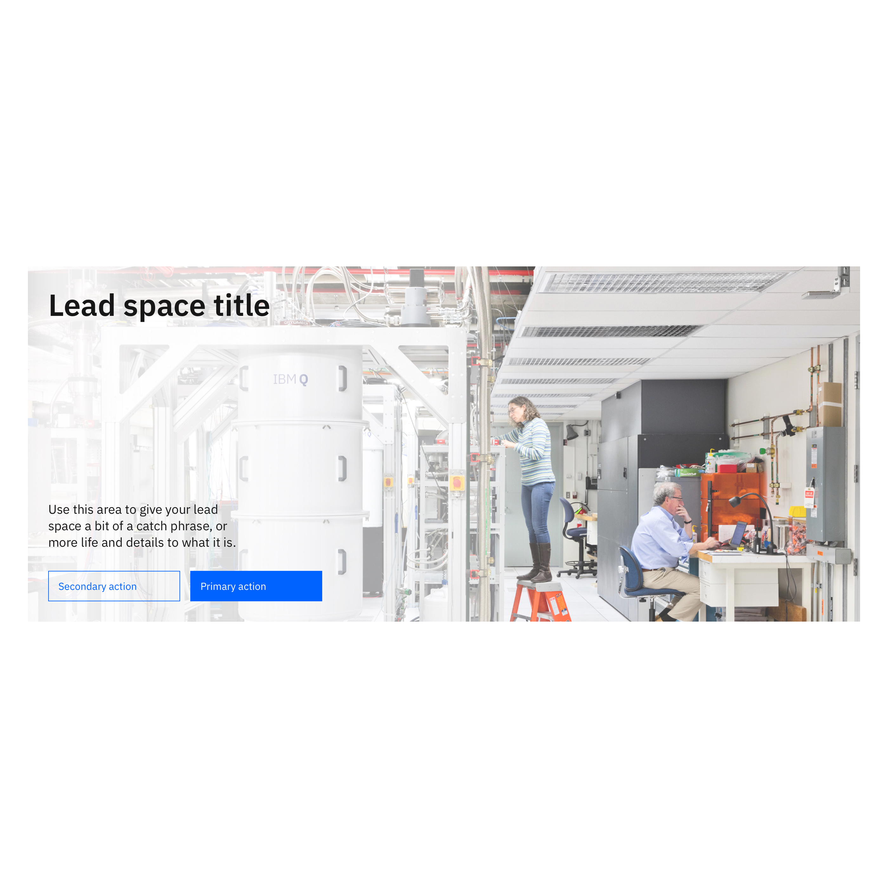
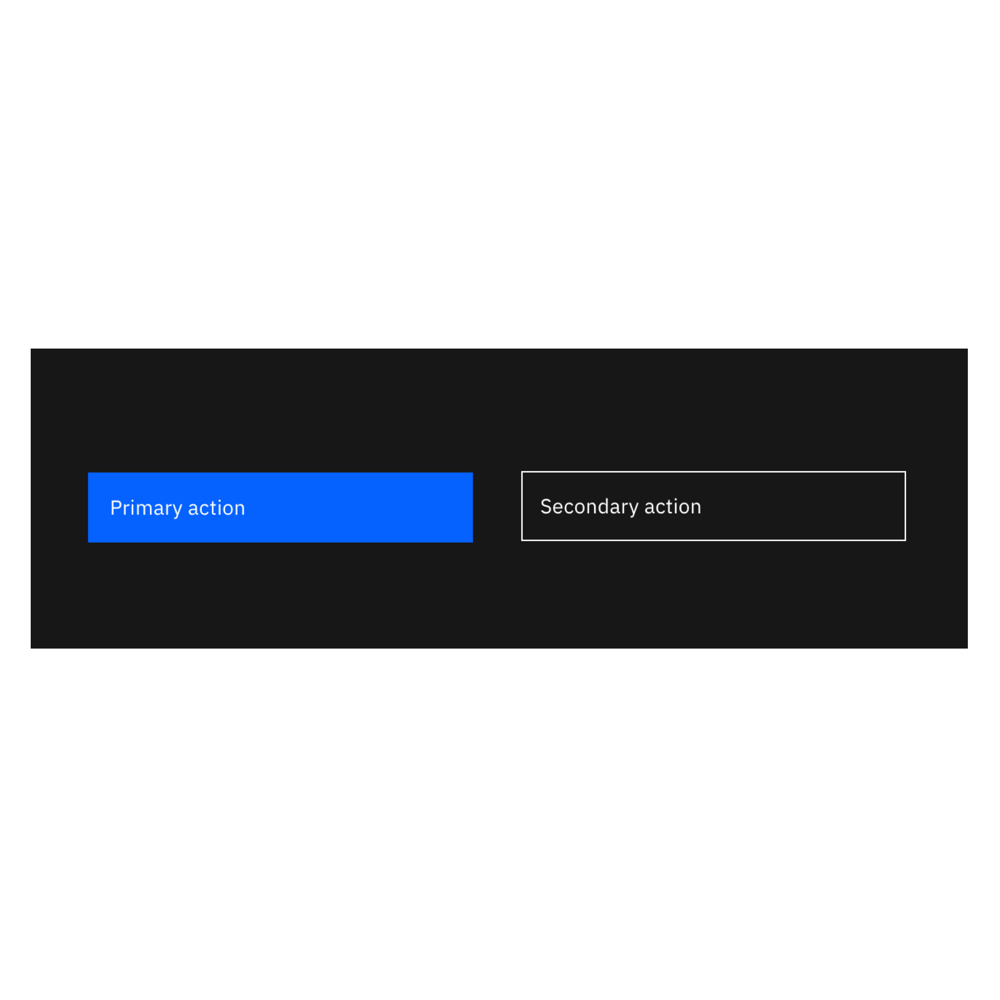
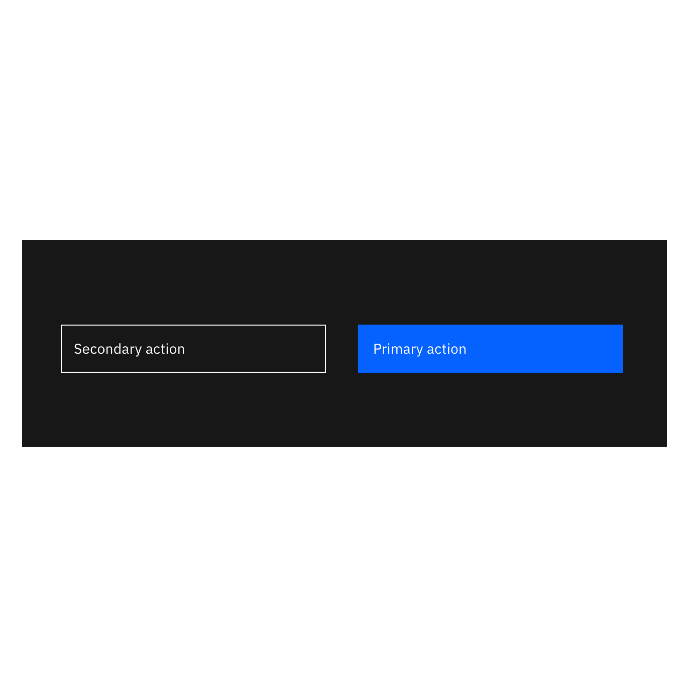
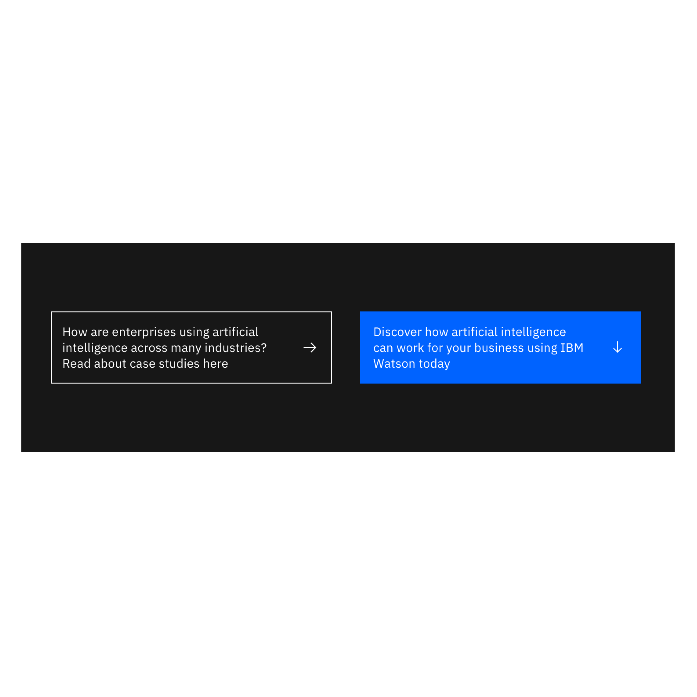
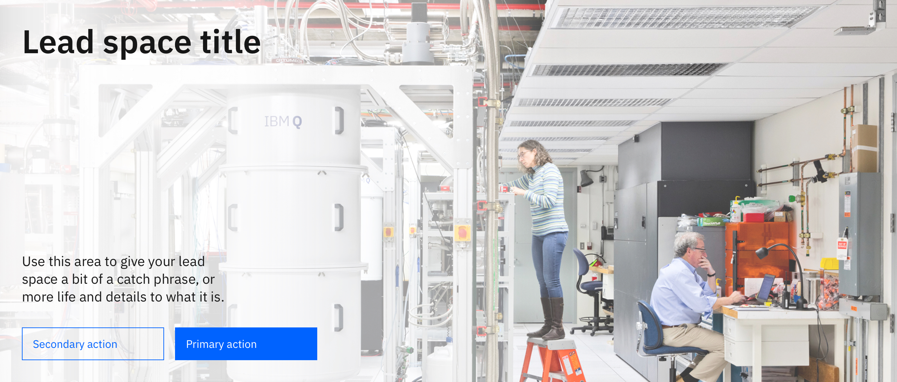

<PageDescription>

A lead space is positioned at the top of a web page and serves as the first site of viewer engagement; its primary purpose is to orient the user when they land on a page and to help them decide whether to continue reading or not as well as orient themselves. 

</PageDescription>

## Overview

When designed and implemented effectively, the lead space can be used to engage visitors immediately in one of the most important moments in the user's journey through a complex web environment. It is the first full-width section below the masthead and can include a stylized background, headline, supporting message and call to action to accommodate user needs. 

## Lead space left-aligned
Can include a title, supporting copy, double CTAs and a background image.

## Lead space centered
Can include a title, supporting copy, double CTAs and a background image.

## Anatomy

| Style options | Type tokens available       | Purpose     | Status     |
| --------      | -----------------------     | ----------  | ---------- |
| left-aligned  | `$expressive-heading-06` `$display-01` | This is the most commonly used Lead space style. The left-aligned type draws the users' attention to the Lead space messaging immediately. Used in marketing and product pages, among others.  | Stable, New |
| centered      | `$expressive-heading-05`  | This option has 4 empty columns on the left and right to accommodate pages that have content positioned in the center of the 16-column grid. Used in the upcoming Learn page template and other long-form reading experiences.  | Under construction |

## Usage guidance

### Content

* Copy in the lead space creates an immediate impact while informing web visitors about the page or service quickly and effectively. 
* Copy should be brief and relevant. This will help to orient and inform the user as quickly as possible.
* Don’t rely on the lead space to deliver the majority of the messaging and information about your topic or offering. The rest of the page is for delivering your message.
* A lead space is not required for all scenarios; follow the guidance for the page type you are creating.

### Typography
Always `left-align` text in a Lead space as per IBM Design Language guidelines.

### Imagery
Images are used to enhance the content or introduce a supporting narrative. There are multiple options to choose from when using imagery in a Lead space. 

Depending on what you want your users to see and how you want them to feel, you may decide to use different types and styles of imagery. 

Image types commonly used in a Lead space include:
* Portrait photography
* Landscape photography
* Illustration

**Usage:** Images should never impact the readability or legibility of the Lead space copy. 
* Where possible, images should blend into the background to avoid hard lines or optical divisions across the Lead space. 
* Consider using a gradient overlay to darken the left area of a background image, if it impacts the text. 
* If using a full-width image in the background, the image should be larger in size than the Lead space size, to allow for browser resizing. If you choose this option, include additional padding around the image.
* Only use one image per lead space.
* Do not use videos.

<Row>
<Column colMd={4} colLg={6}>
  <DoDontExample type="do" caption="The background image should never interfere with the text or call to action buttons.">

  </DoDontExample>
</Column>
<Column colMd={4} colLg={6} >
  <DoDontExample type="do" caption="Use a gradient overlay to ensure maximum readability of text.">

  </DoDontExample>
</Column>
</Row>

#### Image sizing
* For a standard screen, the recommended width for a full-width background image is 1400 pixel minimum, and the size should not exceed 200KB. 
* For a retina display, the recommended width for a full-width background image is 2800 pixels and the size should not exceed 200KB.

### Layout
Within a Lead space, the combination and composition of text, image and components will influence the overall layout and user flow.

Here are some best practices:
* Headline should orient the user on what the page is about.
* Copy following headline should have a clear relationship to the headline.
* Buttons are positioned after the headline or after other lead space copy, if using. 
* Imagery should either be aligned to the right of the lead space, or used as a full-width background.

### Call to action
The maximum number of CTAs per Lead space is two. Note, however, that it is not required to use a call to action in a lead space.

#### How to use CTA copy
Some CTAs are for truly generic actions (e.g., Log in) but many are not. Copy for any CTA should clearly and succinctly tell users what to expect when they click. For example:

* Generic: Learn more
* Better: Get the step-by-step guide

### Call to action options
#### Single CTA
You may choose to use a single CTA to encourage users to do any of the following, for example:
* Sign up
* Log in
* Register today
* Learn more
* Download the smartpaper

**Usage:** Use a primary button only. Icon is optional.
**Caution:** Using a CTA in your Lead space will direct your users to a new section, modal or page. 
If you do not want users to leave the page before discovering information below, consider using a lead space without any CTAs. Keep in mind that scroll depth is a valuable KPI; driving users off your page as soon as they land can be counterproductive.

#### Double CTA
The Double CTA Lead space provides two options for users to continue their journey. 

**Usage:** Use a primary and tertiary style button. Icons are optional.
**Caution:** The primary action should always be positioned after the secondary action. 
Research has shown that placing the secondary action in the secondary position will negatively impact click-through rate. 
However, placing the primary button in the secondary position does not decrease click-through.

<Row>
<Column colMd={4} colLg={6}>
  <DoDontExample type="do" caption="Never place primary CTA on the left when using two buttons.">

  </DoDontExample>
</Column>
<Column colMd={4} colLg={6} >
  <DoDontExample type="do" caption="Always place primary CTA on the right or at the bottom when stacking.">

  </DoDontExample>
</Column>
</Row>

<Row>
<Column colMd={4} colLg={6}>
  <DoDontExample type="do" caption="Never use sentences for CTAs. ">

  </DoDontExample>
</Column>
<Column colMd={4} colLg={6} >
  <DoDontExample type="do" caption="CTA copy should be informative but brief.">

  </DoDontExample>
</Column>
</Row>

### Color themes
There are two color themes to choose from when using Lead space.
* Use Dark (gray-100) when the background image has many shadows, is dimly lit, or uses a dark color palette. The gradient overlay will render dark and the text will be white.
* Use Light (white) when the background image is well-lit or brightly colored. The gradient overlay will render white and the text will be gray-100.

<Caption>Dark</Caption>

<Caption>Light</Caption>

## Style options

### Left-aligned

Content guidance

| Field | Required   | Max character size     |
| -------- | --------- | ---------- |
| Headline | Yes   | XS * 65 English * 85 Translation nicely   |
| Short copy  | No     | M * 120 English* 150 Translation      |
| Secondary call to action  | No     | M * 120 English* 150 Translation      |
| Short copy  | No     | XXS      |
| Primary call to action  | No     | XXS    |
| Background image  | Yes Note: each breakpoint requires a different image scaled to the following sizes: * mobile: 320 X 370* tablet: 672 X 400 * desktop: 1056 X 480     | XXS    |

### Type styles
There are two expressive type styles to choose from when using Lead space left-aligned:
* `$expressive-heading-06` is recommended for pages that surface detailed, productive content to users such as product pages.
* `$display-01` is recommended for pages that have rich editorial, expressive moments such as marketing or campaign pages.

<Caption>$expressive-heading-06 can be used to highlight the name of the product, offering or title of topic. This option is optimal if using all Lead space and components together. </Caption>

<Caption>$display-01 can be used to celebrate strong, editorial messaging. This option is most effective when there is no call to action.</Caption>

### Specifications

<Caption>$expressive-heading-06 at 1312 xlg breakpoint</Caption>

<Caption>$display-01 at 1312 xlg breakpoint</Caption>

<Caption>$expressive-heading-06 and $display-01 mobile display</Caption>

## Pattern in use

<Caption>Lead space left-aligned used to introduce a visitor to Watson and it's usage across platforms. Only one CTA is used [here](https://www.ibm.com/watson). </Caption>

<Caption>Lead space left-aligned used to introduce a visitor to Watson and it's usage across platforms. Only one CTA is used [here](https://www.ibm.com/watson). </Caption>

<Caption>Lead space left-aligned used by IBM Cloud for a high-level introduction. </Caption>

<Caption>Lead space centered used for a Learn page template. There are no CTAs used here.</Caption>

## Resources

<Row className="resource-card-group">
<Column colMd={4} colLg={4} noGutterSm>
    <ResourceCard
      subTitle="IBM.com Pattern React Storybook (experimental)"
      aspectRatio="2:1"
      actionIcon="arrowRight"
      href="https://deploy-preview-78--ibmdotcom-patterns-react-experimental.netlify.com/?path=/story/leadspace--default-with-image"
      >

 
</ResourceCard>
</Column>

<Column colMd={4} colLg={4} noGutterSm>
    <ResourceCard
      subTitle="Drupal design guide"
      aspectRatio="2:1"
      actionIcon="arrowRight"
      href="http://ibm.biz/Drupal_design_guide"
      >

 
</ResourceCard>

</Column>

</Row>

## References

### Research findings
* View A/B testing for Lead space video [here](https://lux.w3ibm.mybluemix.net/library/research/71/).
* View A/B testing for buttons vs text [here](https://lux.w3ibm.mybluemix.net/library/research/2/).

### Developer notes
When viewing the [LeadSpace stories](https://deploy-preview-78--ibmdotcom-patterns-react-experimental.netlify.com/?path=/story/leadspace--default-with-image), the knobs to toggle the buttons’ aspects are different for each story due to storybook knob limitations. In the no image story, button text and links can be modified or buttons can be removed entirely by setting the "buttons" knob to an empty array `[ ]`. Notice when editing the “renderIcon” field, the button icons do not reload hence in the image story, there are dropdown selectors to toggle the button icons. When using the LeadSpace, please follow the button structure in the no image story.

For further developer guidance view the LeadSpace README [here](https://github.com/carbon-design-system/ibm-dotcom-library/blob/master/packages/patterns-react/src/patterns/LeadSpace/README.md).

## Metadata 

* Components: [Button](https://www.carbondesignsystem.com/components/button/code/)
* Elements: [Photography](https://www.ibm.com/design/language/elements/photography/overview/)
* Github: [IBM.com Library](https://github.com/carbon-design-system/ibm-dotcom-library)
