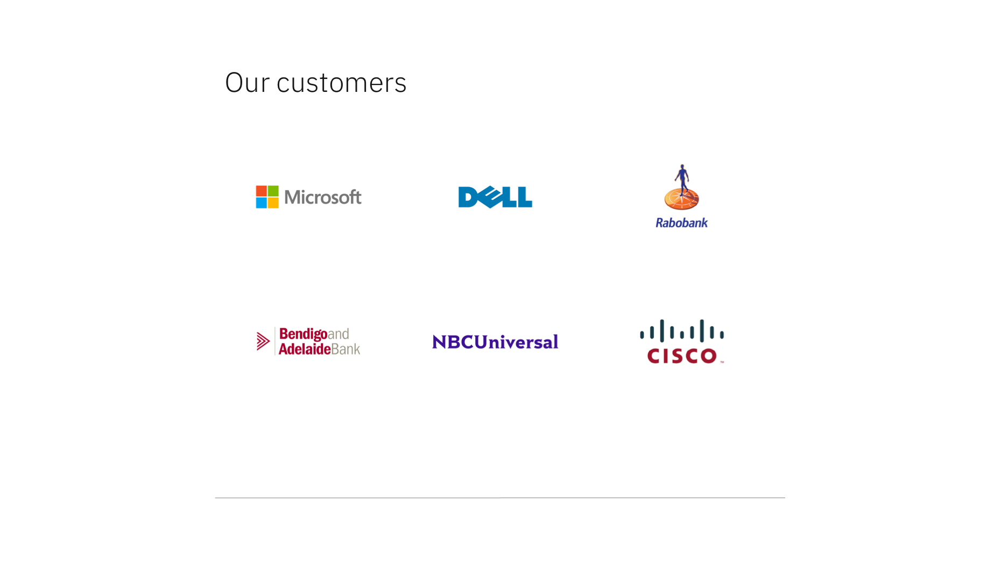

<PageDescription>

The Logo grid — rich is used to present a group of client or partner logos. This pattern is commonly used to establish credibility of the given product or service. 

</PageDescription>

<AnchorLinks>

<AnchorLink>Default</AnchorLink>
<AnchorLink>Development documentation</AnchorLink>
<AnchorLink>Specification documentation</AnchorLink>
<AnchorLink>Feedback</AnchorLink>

</AnchorLinks>

## Default
The Logo grid — rich consists of a heading and a group of logos. Each logo should be contained inside a space (4:3 aspect ratio) and the logos are not clickable.

## Development documentation

| Language      | Status        | Sandbox                                                                              |
| ------------- | -----------   | ------------------------------------------------------------------------             |
| React         | 
<pre>Stable</pre>
        | [View storybook](https://ibmdotcom-react.mybluemix.net/?path=/story/patterns-blocks-logogrid--default)     |
| Vanilla       | 
<pre>Under construction</pre>
  |

## Specification documentation

Structure and spacing measurements for the Logo grid &mdash; rich can be viewed [here](https://ibm.box.com/s/2c2dt2fivbmbcce29oul7hjaktjaqj26).

## Feedback

Help us improve this component by providing feedback, asking questions, and leaving any other comments on [GitHub](https://github.com/carbon-design-system/ibm-dotcom-library).
