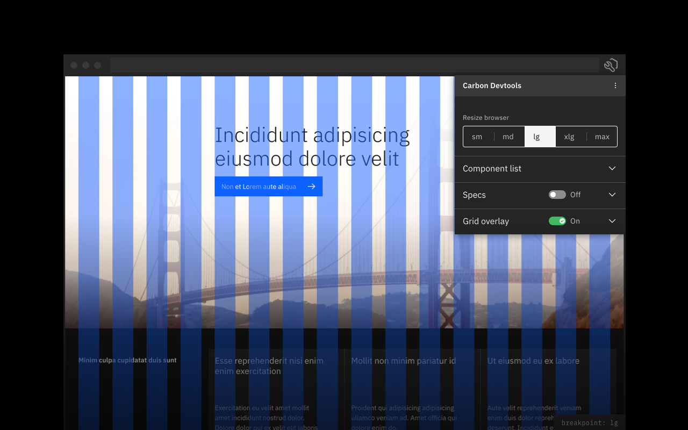
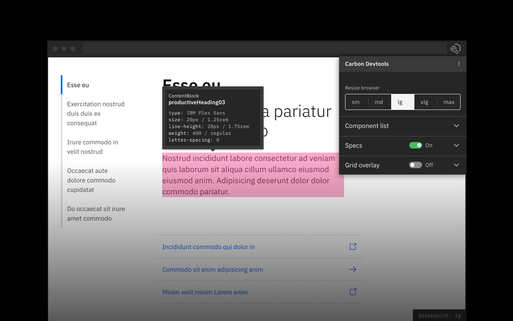
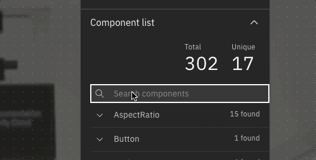
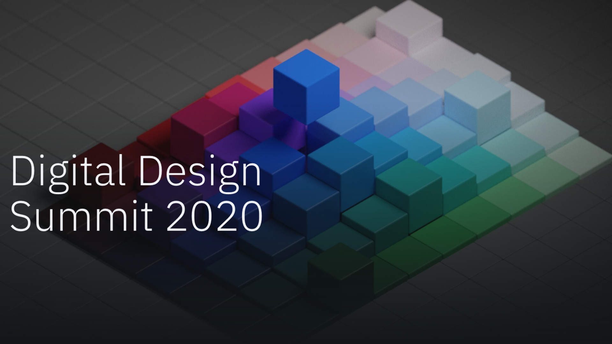

<PageDescription>

A basic set of tools for teams to use on a live page when building Carbon pages.

</PageDescription>

<AnchorLinks>
  <AnchorLink>Get the tool</AnchorLink>
  <AnchorLink>What’s included</AnchorLink>
  <AnchorLink>Contribute</AnchorLink>
  <AnchorLink>Latest</AnchorLink>
</AnchorLinks>

## Get the tool

<CardGroup>
<MiniCard
  linkProps={{ target: '_blank', rel: 'noopener' }}
  title="Install on Chrome"
  href="https://ibm.biz/carbon-devtools-chrome"
>

</MiniCard>
<MiniCard
  linkProps={{ target: '_blank', rel: 'noopener' }}
  title="Install on Firefox"
  href="https://ibm.biz/carbon-devtools-firefox"
>

</MiniCard>
</CardGroup>

## What's included

<Row>
<Column colMd={8} colLg={8} noGutterSm>

<Video
  src="../../images/resources/carbon-devtools/carbon-devtools-demo.mp4"
  poster="../../images/resources/carbon-devtools/carbon-devtools.png"
/>

</Column>
<Column colMd={2} colLg={3} offsetMd={1} offsetLg={1}>
  <Aside>

_"Carbon Devtools is ridiculously awesome!!! Fantastic plugin!!!"_

 

_– Shawn Hoglund_

  </Aside>
</Column>
</Row>

### Carbon validation

Instantly validate whether a live page supports Carbon or not by merely opening
the tool. Upon opening the tool it will isntantly scan the page to find any
Carbon components.

### Align to grid

<Row>
<Column colMd={8} colLg={8}>

Use the grid overlay feature to lay the 2x and mini unit grid on top of your
page to quickly check the alignment of your page's layout. breakpoints.

</Column>
<Column colMd={2} colLg={3} offsetMd={1} offsetLg={1}>
  <Aside>

_"Carbon Devtools has been a game changer for design QA"_

 

_– Lila Title_

  </Aside>
</Column>
</Row>

<Row>
<Column colMd={6} colLg={6} noGutterSm>

</Column>
</Row>

### Identify tokens

Switch between a number of speccing options like color, spacing, and typography
to identify what Carbon tokens are being used for a component or element on the
page.

<Row>
<Column colMd={6} colLg={6} noGutterSm>

</Column>
</Row>

### Component list

Quickly get an inventory of all the Carbon supported components being used on a
page. Search for a specific component, and click on it to find where it's
located on the page.

<Row>
<Column colMd={6} colLg={6} noGutterSm>
<GifPlayer>

</GifPlayer>
</Column>
</Row>

### Resize browser

Resize your browser to any supported Carbon breakpoint at the click of a button.
In addition you can toggle on the Breakpoint label so you always know what
breakpoint your viewing your page at.

### Shortcuts

<Row>
<Column colMd={8} colLg={8}>

Once the tool is launched, and the page is validated you can use shortcuts to
toggle features on and off, and also to interact with the grid allowing you to
toggle individual columns.

</Column>
<Column colMd={2} colLg={3} offsetMd={1} offsetLg={1}>
  <Aside>

_"Carbon Devtools is so impactful for the entire Carbon community as we strive
for excellency."_

 

_– Matthew Rosno_

  </Aside>
</Column>
</Row>

## Contribute

Help us improve this tool by submitting an issue, or requesting a new feature on
[GitHub](https://ibm.biz/carbon-devtools).

<Row className="resource-card-group">
<Column colMd={4} colLg={4} noGutterSm noGutterMdLeft>
<ResourceCard
  title="Submit issue or feature"
  subTitle="Carbon Devtools"
  href="https://github.com/carbon-design-system/devtools/issues/new/choose">

</ResourceCard>
</Column>
<Column colMd={4} colLg={4} noGutterSm noGutterMdLeft>
<ResourceCard
  title="View releases"
  subTitle="Carbon Devtools"
  href="https://github.com/carbon-design-system/devtools/releases">

</ResourceCard>
</Column>
</Row>

## Latest

<Row>
<Column colMd={4} colLg={4} noGutterMdLeft>
<ArticleCard
  author="James Dow"
  readTime="Read time: 1 hr"
  title="FEDucation: Intro to Carbon Devtools web extension"
  href="https://ec.yourlearning.ibm.com/w3/playback/10133695"
  actionIcon="Launch">

</ArticleCard>

</Column>
<Column colMd={4} colLg={4} noGutterMdLeft>
<ArticleCard
  author="Carbon for IBM.com team"
  readTime="Watch time: 3 hr"
  title="Digital Design Summit 2020: Day 2"
  href="https://ibm.ent.box.com/s/4qxdwnry8vo0bg1nerahj6ha4t8jx714/file/730958761081"
  actionIcon="Launch">

</ArticleCard>

</Column>
</Row>
