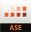

<PageDescription>

Everything you need to learn about, work with, and contribute to Carbon for
IBM.com.

</PageDescription>

<AnchorLinks>

<AnchorLink>Development resources</AnchorLink>
<AnchorLink>Design resources</AnchorLink>
<AnchorLink>Tools</AnchorLink>

</AnchorLinks>

## Development resources

### GitHub repos

<Row className="resource-card-group">
  <Column colMd={4} colLg={4} noGutterSm>
<ResourceCard
  subTitle="Carbon for IBM.com"
  href="https://github.com/carbon-design-system/carbon-for-ibm-dotcom"
>

</ResourceCard>
  </Column>
  <Column colMd={4} colLg={4} noGutterSm>
<ResourceCard
  subTitle="Carbon for IBM.com NextJS Template"
  href="https://github.com/carbon-design-system/carbon-for-ibm-dotcom-nextjs-template"
>

</ResourceCard>
  </Column>
  <Column colMd={4} colLg={4} noGutterSm>
<ResourceCard
  subTitle="Carbon for IBM.com Web Components Template"
  href="https://github.com/carbon-design-system/carbon-for-ibm-dotcom-web-components-template"
>

</ResourceCard>
  </Column>
</Row>

### Storybook

<Row className="resource-card-group">
<Column colMd={4} colLg={4} noGutterSm>
<ResourceCard
  subTitle="Carbon for IBM.com Storybook React"
  href="https://www.ibm.com/standards/carbon/react"
>

</ResourceCard>
</Column>

<Column colMd={4} colLg={4} noGutterSm>
<ResourceCard
  subTitle="Carbon for IBM.com Storybook Web Components"
  href="https://www.ibm.com/standards/carbon/web-components"
>

</ResourceCard>
</Column>

<Column colMd={4} colLg={4} noGutterSm>
<ResourceCard
  subTitle="Carbon Expressive Theme"
  href="https://carbon-expressive.mybluemix.net"
>

</ResourceCard>
</Column>
</Row>

### Documentation

<Row className="resource-card-group">
  <Column colMd={4} colLg={4} noGutterSm>
<ResourceCard
  subTitle="Building for IBM.com"
  href="https://github.com/carbon-design-system/carbon-for-ibm-dotcom/blob/main/docs/building-for-ibm-dotcom.md"
>

</ResourceCard>
</Column>
</Row>

### API Docs

<Row className="resource-card-group">
<Column colMd={4} colLg={4} noGutterSm>
<ResourceCard
  subTitle="Services"
  href="https://ibmdotcom-services.mybluemix.net"
>

</ResourceCard>
  </Column>
<Column colMd={4} colLg={4} noGutterSm>
<ResourceCard
  subTitle="Utilities"
  href="https://ibmdotcom-utilities.mybluemix.net"
>

</ResourceCard>
  </Column>
</Row>

## Design resources

### Carbon for IBM.com

All Carbon for IBM.com design resources are available on our [Designing](https://www.ibm.com/standards/carbon/designing) page.

### Color, grid, and icons

<Row className="resource-card-group">

  <Column colMd={4} colLg={4} noGutterSm>
<ResourceCard
  subTitle="RGB color palettes (.clr)"
  actionIcon="download"
  href="https://github.com/carbon-design-system/carbon/raw/master/packages/colors/artifacts/IBM_Colors.zip"
>

</ResourceCard>
  </Column>

  <Column colMd={4} colLg={4} noGutterSm>
<ResourceCard
  subTitle="IBM Design Language library"
  actionIcon="download"
  href="sketch://add-library/cloud/nwqmk"
>

</ResourceCard>
  </Column>

  <Column colMd={4} colLg={4} noGutterSm>
<ResourceCard
  subTitle="Color contrast checker"
  href="https://marijohannessen.github.io/color-contrast-checker/"
>

</ResourceCard>
  </Column>

  <Column colMd={4} colLg={4} noGutterSm>
<ResourceCard
  subTitle="IBM Icons (16px, 20px) library"
  actionIcon="download"
  href="sketch://add-library/cloud/KW2yr"
>

</ResourceCard>
  </Column>

  <Column colMd={4} colLg={4} noGutterSm>
<ResourceCard
  subTitle="IBM Icons (24px, 32px) library"
  actionIcon="download"
  href="sketch://add-library/cloud/2bwkM"
>

</ResourceCard>
  </Column>

  <Column colMd={4} colLg={4} noGutterSm>
    <ResourceCard
        subTitle="IBM Grid template"
        aspectRatio="2:1"
        href="https://sketch.cloud/s/ngV7z"
    >

</ResourceCard>
  </Column>

</Row>

 

## Tools

<Row className="resource-card-group">

  <Column colMd={4} colLg={4} noGutterSm>
<ResourceCard
  subTitle="Carbon Devtools"
  href="https://github.com/carbon-design-system/devtools"
>

</ResourceCard>
  </Column>

  <Column colMd={4} colLg={4} noGutterSm>
<ResourceCard
  subTitle="IBM Style"
  href="https://ibmdocs-test.mybluemix.net/docs/en/ibm-style"
>

</ResourceCard>
  </Column>

  <Column colMd={4} colLg={4} noGutterSm>
<ResourceCard
  subTitle="IBM style guideline"
  href="https://apps.na.collabserv.com/communities/service/html/communitystart?communityUuid=279b622e-3902-4086-9cc7-6c07d8d2d745"
>

</ResourceCard>
  </Column>

  <Column colMd={4} colLg={4} noGutterSm>
<ResourceCard
  subTitle="Color contrast checker"
  href="https://marijohannessen.github.io/color-contrast-checker/"
>

</ResourceCard>
  </Column>

  <Column colMd={4} colLg={4} noGutterSm>
<ResourceCard
  subTitle="IBM Accessibility"
  href="https://w3.ibm.com/able/"
>

</ResourceCard>

  </Column>

  <Column colMd={4} colLg={4} noGutterSm>
    <ResourceCard
      subTitle="For coding and designing questions: #carbon-for-ibm-dotcom"
      href="https://ibm-studios.slack.com/archives/C2PLX8GQ6"
    >

</ResourceCard>
  </Column>
</Row>
