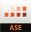

<PageDescription>

Everything you need to learn about, work with, and contribute to Carbon for IBM.com.

</PageDescription>

<AnchorLinks>

<AnchorLink>Development resources</AnchorLink>
<AnchorLink>Design resources</AnchorLink>
<AnchorLink>Tools</AnchorLink>

</AnchorLinks>

## Development resources

### GitHub repos
<Row className="resource-card-group">
  <Column colMd={4} colLg={4} noGutterSm>
<ResourceCard
  subTitle="Carbon for IBM.com"
  href="https://github.com/carbon-design-system/carbon-for-ibm-dotcom"
>

</ResourceCard>
  </Column>
  <Column colMd={4} colLg={4} noGutterSm>
<ResourceCard
  subTitle="Carbon for IBM.com NextJS Template"
  href="https://github.com/carbon-design-system/carbon-for-ibm-dotcom-nextjs-template"
>

</ResourceCard>
  </Column>
</Row>

### Storybook

<Row className="resource-card-group">
<Column colMd={4} colLg={4} noGutterSm>
<ResourceCard
  subTitle="Carbon for IBM.com Storybook React"
  href="https://ibmdotcom-react.mybluemix.net"
>

</ResourceCard>
</Column>

<Column colMd={4} colLg={4} noGutterSm>
<ResourceCard
  subTitle="Carbon for IBM.com Storybook Web Components"
  href="https://ibmdotcom-web-components.mybluemix.net"
>

</ResourceCard>
</Column>

<Column colMd={4} colLg={4} noGutterSm>
<ResourceCard
  subTitle="Carbon Core Library React"
  href="https://react.carbondesignsystem.com/?path=/story/getting-started-welcome--welcome"
>

</ResourceCard>
</Column>

<Column colMd={4} colLg={4} noGutterSm>
<ResourceCard
  subTitle="Carbon Core Library Web Components"
  href="https://web-components.carbondesignsystem.com/?path=/story/introduction-welcome--page"
>

</ResourceCard>
</Column>
</Row>

### Documentation
<Row className="resource-card-group">
  <Column colMd={4} colLg={4} noGutterSm>
<ResourceCard
  subTitle="Building for IBM.com"
  href="https://github.com/carbon-design-system/carbon-for-ibm-dotcom/blob/master/docs/building-for-ibm-dotcom.md"
>

</ResourceCard>
</Column>
</Row>

### API Docs
<Row className="resource-card-group">
<Column colMd={4} colLg={4} noGutterSm>
<ResourceCard
  subTitle="Services"
  href="https://ibmdotcom-services.mybluemix.net"
>

</ResourceCard>
  </Column>
<Column colMd={4} colLg={4} noGutterSm>
<ResourceCard
  subTitle="Utilities"
  href="https://ibmdotcom-utilities.mybluemix.net"
>

</ResourceCard>
  </Column>
</Row>

## Design resources

### Carbon for IBM.com

Carbon for IBM.com components each has individual spec files. See individual component pages for detail.

The Expressive Theme has been integrated into Carbon Design System's core library. All Carbon adopters can get both productive and expressive experiences from the same [library source](https://www.carbondesignsystem.com/designing/kits/sketch/).

<Row className="resource-card-group">
  <Column colMd={4} colLg={4} noGutterSm>
<ResourceCard
  subTitle="Carbon design kit"
  href="https://www.carbondesignsystem.com/designing/kits/sketch/"
>

</ResourceCard>
  </Column>
</Row>

### Color, grid, and icons

<Row className="resource-card-group">
  
  <Column colMd={4} colLg={4} noGutterSm>
<ResourceCard
  subTitle="RGB color palettes (.clr)"
  actionIcon="download"             
  href="https://github.com/carbon-design-system/carbon/raw/master/packages/colors/artifacts/IBM_Colors.zip"
>

      
</ResourceCard>
  </Column>
  
  <Column colMd={4} colLg={4} noGutterSm>
<ResourceCard
  subTitle="IBM Design Language library"
  actionIcon="download"             
  href="sketch://add-library/cloud/nwqmk"
>

      
</ResourceCard>
  </Column>
  
  <Column colMd={4} colLg={4} noGutterSm>
<ResourceCard
  subTitle="IBM Icons (16px, 20px) library"
  actionIcon="download"             
  href="sketch://add-library/cloud/KW2yr"
>

      
</ResourceCard>
  </Column>
  
  <Column colMd={4} colLg={4} noGutterSm>
<ResourceCard
  subTitle="IBM Icons (24px, 32px) library"
  actionIcon="download"             
  href="sketch://add-library/cloud/2bwkM"
>

      
</ResourceCard>
  </Column>
  
  <Column colMd={4} colLg={4} noGutterSm>
    <ResourceCard
        subTitle="IBM Grid template"
        aspectRatio="2:1"
        href="https://sketch.cloud/s/ngV7z"
    >

</ResourceCard>
  </Column>
  
</Row>

 

#### IBM Plex 
Carbon for IBM.com uses the open-source typeface [IBM Plex](https://github.com/ibm/plex) – carefully designed to meet IBM’s needs as a global technology company and reflect IBM’s spirit, beliefs, and design principles.

#### IBM Design Language
Carbon for IBM.com delivers the [IBM Design Language](https://www.ibm.com/design/language/) as tools for designers and developers, guidance, tutorials, and support. 

#### Carbon Design System
[Carbon](https://www.carbondesignsystem.com) is the open-source design system for IBM products experiences. 

## Tools

<Row className="resource-card-group">
  
  <Column colMd={4} colLg={4} noGutterSm>
<ResourceCard
  subTitle="Carbon Devtools"
  href="https://github.com/carbon-design-system/devtools"
>

      
</ResourceCard>
  </Column>
  
  <Column colMd={4} colLg={4} noGutterSm>
<ResourceCard
  subTitle="IBM User Research Library (CIO)"
  href="https://lux.w3ibm.mybluemix.net/library/"
>

      
</ResourceCard>
  </Column>
  
  <Column colMd={4} colLg={4} noGutterSm>
<ResourceCard
  subTitle="IBM style guideline"
  href="https://apps.na.collabserv.com/communities/service/html/communitystart?communityUuid=279b622e-3902-4086-9cc7-6c07d8d2d745"
>

      
</ResourceCard>
  </Column>

  <Column colMd={4} colLg={4} noGutterSm>
<ResourceCard
  subTitle="Color contrast checker"
  href="https://marijohannessen.github.io/color-contrast-checker/"
>

      
</ResourceCard>
  </Column>
  
  <Column colMd={4} colLg={4} noGutterSm>
<ResourceCard
  subTitle="IBM accessibility"
  href="https://w3.ibm.com/able/"
>

      
</ResourceCard>
    
  </Column>
  
  <Column colMd={4} colLg={4} noGutterSm>
    <ResourceCard
      subTitle="Drupal guideline"
      href="https://cognitive-app.slack.com/archives/C5DJVE8AY"
    >

      
</ResourceCard>
  </Column>
  
  <Column colMd={4} colLg={4} noGutterSm>
    <ResourceCard
      subTitle="For coding and designing questions: #carbon-for-ibm-dotcom"
      href="https://ibm-studios.slack.com/archives/C2PLX8GQ6"
    >

      
</ResourceCard>
  </Column>
</Row>

