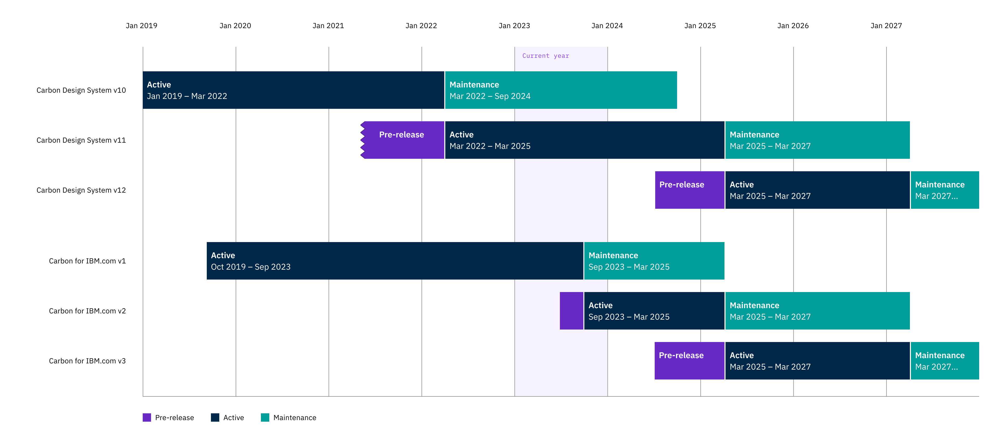

<PageDescription>

We are excited to announce the release of **Carbon for IBM.com v2**! This update focuses on upgrading to Carbon v11, improving the layout experience for ease of authoring as well as other component improvements for designers and developers.

</PageDescription>

## Overview

As with a major release, there will be some breaking changes that will require minor redesigning and/or content adjustments. The Carbon for IBM.com team will provide design and development guidance to help facilitate the migration to v2.

### Information sessions

Watch the Carbon for IBM.com team showcase the updates in Carbon for IBM.com v2. _Note that information session content is accessible to IBMers only._

| Session date | Recording | Slides |
| -------- | -------- | -------- |
| **Session 1 – May 22** | [Recording](https://ec.yourlearning.ibm.com/w3/playback/10372722) | [Slides](https://www.figma.com/proto/4FYUucHe9mN2r8V19Tlno3/Carbon-for-IBM.com-v2-Presentation?page-id=86%3A62780&type=design&node-id=86-65171&viewport=1899%2C8211%2C0.32&scaling=min-zoom) |
| **Session 2 – July 10** | [Recording](https://ec.yourlearning.ibm.com/w3/playback/10372711) | [Slides](https://www.figma.com/proto/oRxShbzUMUVPrsphNIYNgJ/Carbon-for-IBM.com-v2-Presentation-Pt-2?page-id=86%3A62780&type=design&node-id=86-65171&viewport=4255%2C18244%2C0.57&t=UH1o4elM9wL4Omn0-1&scaling=scale-down)

### What are the benefits?

- Upgrade to Carbon v11, which includes updated color and type tokens, components, and accessibility enhancements.
- Faster package build times
- Faster page load times
- Web Components upgraded to use Lit v2
- Simplified component list with more flexibility for each component
- Component enhancements for authoring such as content section, content block, and Masthead v2
- Improvements to spacing logic across Carbon for IBM.com's Layout and UI components
- Accessibility improvements for components

## Long-term Support timeline

Visit our Github for a table version of our [long-term support schedule](https://github.com/carbon-design-system/carbon-for-ibm-dotcom/blob/main/docs/release-schedule.md)

## FAQ

#### When will Carbon for IBM.com v2 be ready for production?

Carbon for IBM.com was release on December 11, 2023 and is ready to be used in production environments!

#### What is required for migration?

We have done our best to minimize migration efforts for our adopters. Please see our [migration docs](https://github.com/carbon-design-system/carbon-for-ibm-dotcom/blob/release/v2.0.0/docs/dotcom-v2-migration.md) for more details.

#### When do adopters have to migrate?

Adopters should plan to migrate their application, webpages, and/or docs to Carbon for IBM.com v2 _before the end of maintenance of v1_. Ensure you have built the time for migration into your planning for 2024. If you remain on v1 after the end of maintenance, your application could have a risk with unresolved security vulnerabilities and/or outdated upstream dependencies. See the Long-term Support timeline above.

#### What frameworks will be supported?

Carbon for IBM.com v2 will no longer support React and focus fully on web components. This applies to the [@carbon/web-components](https://github.com/carbon-design-system/carbon-for-ibm-dotcom/tree/main/packages/carbon-web-components) and [@carbon/ibmdotcom-web-components](https://github.com/carbon-design-system/carbon-for-ibm-dotcom/tree/main/packages/web-components) packages. Both packages will still provide React wrappers for projects requiring React.

## Questions?

We're here to answer any questions!
Reach out to us via [GitHub](https://github.com/carbon-design-system/carbon-for-ibm-dotcom/issues/new?assignees=&labels=question&projects=&template=question.yaml&title=%5BYOUR+TITLE%5D%3A+Brief+description) or [Slack](https://cognitive-app.slack.com/archives/C2PLX8GQ6) 

IBMers can join our Office Hours:

- [Developers](https://ibm.box.com/s/894z9uk7qyhdl65s3tjs0xnim3mb1b17)
- [Designers](https://ec.yourlearning.ibm.com/w3/event/10323408)
