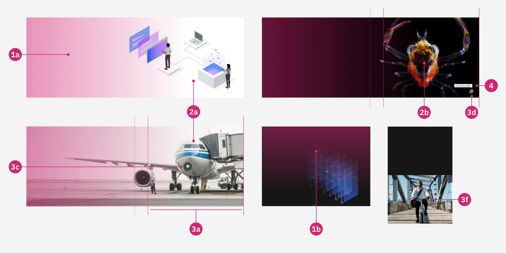

`Core` `Functional` <!-- category start --><!-- category end -->

The [[Background media]] shares the same core functionality of background media across our different components.

<!-- toc start open="true" depthStart="3" depthEnd="5" --><!-- toc end -->

  
<strong>Dependencies</strong> (<!-- dependencyCount start --><!-- dependencyCount end -->)
 

- [[Image]]
- [[Video]]
- [[Expressive modal]]
- [[Lightbox media viewer]]
- [[Carbon tooltip]]

 

<!-- usedby start open="true" -->

_{{usedby auto populates}}_

<!-- usedby end -->

<!-- backlinks start open="true" -->

_{{backlinks auto populates}}_

<!-- backlinks end -->

  
<strong>Resources</strong>
 

- r1: [Box folder](https://ibm.ent.box.com/folder/137924469929)

 

 

>  See box
> folder [[r1](#resources)] for more details

 

### 1. Gradient

`optional`

An optional gradient added over the media to make sure the background image or video do not cause accessibility issues.

 [Back to top](#wiki-wrapper) 

  

#### 1a. Gradient left to right

`optional`

A left to right gradient added over the media due to accessibility requirements.

 [Back to top](#wiki-wrapper) 

  

#### 1b. Gradient top to bottom

`optional`

A top to bottom gradient added over the media due to accessibility requirements.

 [Back to top](#wiki-wrapper) 

  

### 2. Media (image or video)

`optional`

Provides the adopter with option to use either [[Image]] or [[Video]] here.

 [Back to top](#wiki-wrapper) 

  

#### 2a. Image

`optional`

Provides the adopter with option to use [[Image]] as a cover or background image.

>  See
> [[Image]] for more information.

 [Back to top](#wiki-wrapper) 

  

#### 2b. Video

`optional`

Provides the adopter with option to use [[Video]] as a cover or background video.

>  See
> [[Video]] for more information.

 [Back to top](#wiki-wrapper) 

  

### 3. Hot stop (clickable area)

`optional`

An optional clickable `Area` to play or pause the background video, or to open a modal. It provides the user with
options to interact with the video.

 [Back to top](#wiki-wrapper) 

  

### 4. Buttons

`required`

Custom controls for media.

 [Back to top](#wiki-wrapper) 

  

#### 4a. Button to open overlay

`required`

Custom play button for the adopter to open an [Expressive modal] or [Lightbox media viewer].

 [Back to top](#wiki-wrapper) 

  

#### 4b. Play/pause custom video controls with an optional progress outline

`required`

Custom play/pause buttons for the adopter to interact with background video when hidden video control bar. Also optional
progress outline is available.

 [Back to top](#wiki-wrapper) 

  

### 5. Tooltip

`optional`

[Carbon tooltip] with message to play/pause the media.

 [Back to top](#wiki-wrapper) 

  
